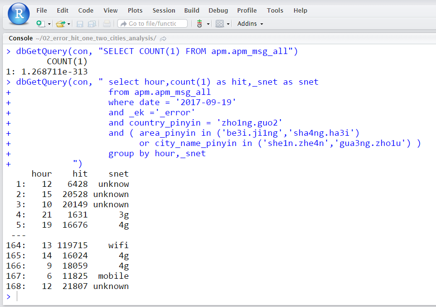
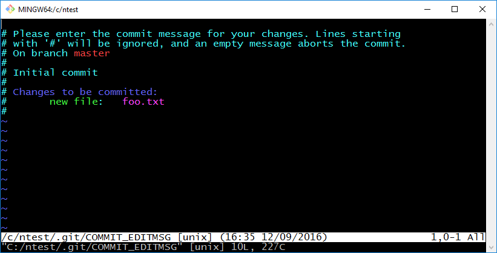
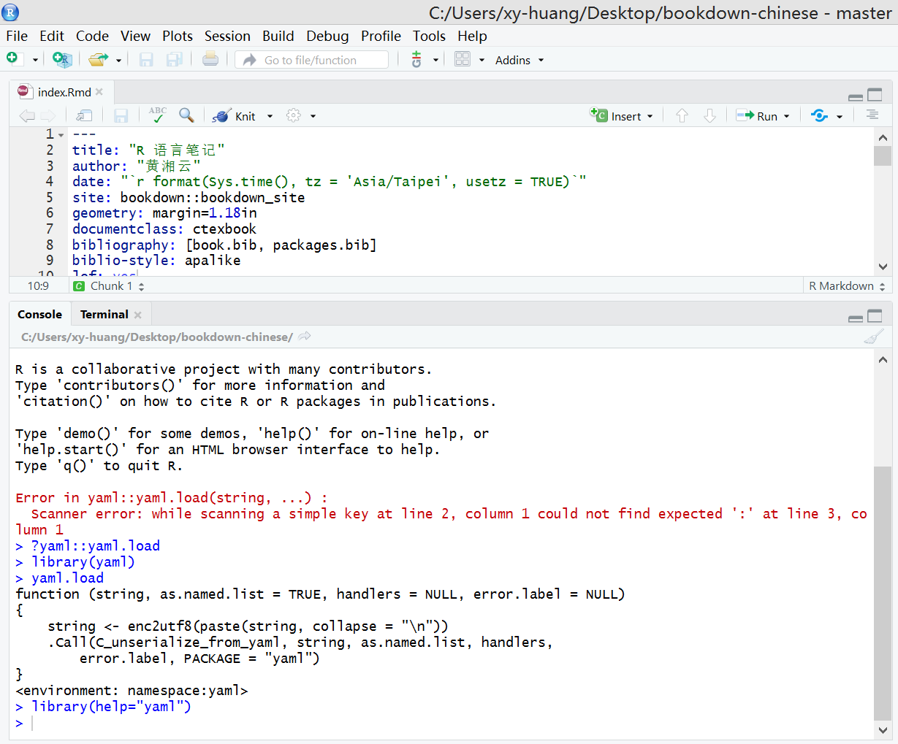

\mainmatter

# 安装与配置 {#install-setup}


## 安装 R 软件

Windows 下安装指导见《R语言忍者秘笈》的第二章^[<https://bookdown.org/yihui/r-ninja/setup.html>]

推荐没事多翻翻官网 [FAQ 文档](https://mirrors.tuna.tsinghua.edu.cn/CRAN/doc/FAQ/R-FAQ.html) 以及6本自带的手册

* **An Introduction to R** (R-intro) includes information on data types, programming elements, statistical modeling and graphics. This document is based on the **Notes on S-PLUS** by Bill Venables and David Smith.
    + 介绍数据类型，编程基础，统计模型和图形
* **Writing R Extensions** (R-exts) currently describes the process of creating R add-on packages, writing R documentation, R’s system and foreign language interfaces, and the R API.
    + 描述创建扩展包、写R包文档的过程，介绍 R 系统，外部语言接口以及 R 的API
* **R Data Import/Export** (R-data) is a guide to importing and exporting data to and from R.
    + 从 R 导入和导出数据
* **The R Language Definition** (R-lang), a first version of the *Kernighan & Ritchie of R*, explains evaluation, parsing, object oriented programming, computing on the language, and so forth.
    + 介绍 R 语言程序设计，解释计算、解析、面向对象编程以及计算
* **R Installation and Administration** (R-admin).
    + R 安装和管理
* **R Internals** (R-ints) is a guide to R’s internal structures. (Added in R 2.4.0.)
    + R 内部结构指南

Hadley Wickham 正在写文档介绍 [Documentation for R's internal C API](https://github.com/hadley/r-internals)

- 从源码编译 R 的需求在哪呢？

1. 爱折腾的极客：玩配置，学习 make 相关工具和 Linux 世界的依赖
2. 追求性能：如 [LFS 支持](http://users.suse.com/~aj/linux_lfs.html) 和 [Intel MKL 加速](http://dirk.eddelbuettel.com/blog/2018/04/15/#018_mkl_for_debian_ubuntu)
3. 环境限制：CentOS 6/7 或者红帽系统，自带的R版本比较落后
4. 微软提供的一套 MSR （这里不需要编译）

现在很多东西都讲究 docker 化，直接往 CentOS 系统上编译安装最新版 R 会越来越少，这里给个例子，在 docker 内安装 R 和扩展包，Dockerfile 的内容如下


```r
cat(readLines(con <- file("docs/Dockerfile", encoding = "UTF-8")) ,sep = "\n")
#> FROM rocker/geospatial:latest
#> 
#> MAINTAINER Xiangyun Huang <xiangyunfaith@outlook.com>
#> 
#> # System dependencies for required R packages
#> RUN apt-get update \
#>   && apt-get install -y --no-install-recommends \
#>     imagemagick \
#>     optipng \
#>     curl \
#>     dieharder \
#>     libdieharder3 \
#>     libdieharder-dev \
#>     libpoppler-cpp-dev \
#>     python-dev \
#>     python-pip \
#>     python-tk \
#>     octave \
#>     proj-bin \
#>     libpaper-utils \
#>     libatlas3-base \
#>     build-essential \
#>     python-wheel \
#>     pstoedit \
#>   && pip install numpy \
#>     matplotlib
#> 
#> # TinyTeX for PDF
#> RUN mkdir ~/.fonts \
#>   && curl -o ~/.fonts/Inconsolata-Bold.ttf https://raw.githubusercontent.com/google/fonts/master/ofl/inconsolata/Inconsolata-Bold.ttf \
#>   && curl -o ~/.fonts/Inconsolata-Regular.ttf https://raw.githubusercontent.com/google/fonts/master/ofl/inconsolata/Inconsolata-Regular.ttf \
#>   && fc-cache -fv ~/.fonts \
#>   && git clone --depth=1 --branch=master https://github.com/XiangyunHuang/bookdown-chinese.git \
#>   && cd bookdown-chinese \
#>   && tlmgr update --all --self \
#>   && tlmgr install $(cat TeXLive.pkgs | tr '\n' ' ') || true \
#>   && Rscript -e "devtools::install_github('leonawicz/mapmate')" \
#>   && Rscript -e "devtools::install_github('dgrtwo/gganimate')" \
#>   && Rscript -e "bookdown::render_book('index.Rmd')"
#> 
#> RUN mkdir /liftrroot/
#> WORKDIR /liftrroot/
```

这种方式可以安装到最新版的 R，同时省去了自己配置安装过程中的麻烦，只是系统自带的 texlive 还是比较旧，如何安装 tlmgr 管理器，安装新的 TeX 包到之前的位置值得考虑，主要目的是为中文的 R Markdown 文档服务。

Pandoc 提供的 LaTeX 文类，是希望用户在 YAML 指定 CJKmainfont 等，显式地安装系统中文字体供使用，楷体和宋体，文泉驿黑体都是系统自带的。要我说可以用思源黑体和宋体，或者自己拷贝一份中文字体到 `~/.fonts` 然后刷新，就是添加这样一段代码，这种做法使用最广

```
RUN mkdir ~/.fonts \
  && curl -o ~/.fonts/Inconsolata-Bold.ttf https://raw.githubusercontent.com/google/fonts/master/ofl/inconsolata/Inconsolata-Bold.ttf \
  && curl -o ~/.fonts/Inconsolata-Regular.ttf https://raw.githubusercontent.com/google/fonts/master/ofl/inconsolata/Inconsolata-Regular.ttf \
  && fc-cache -fv ~/.fonts \
```

文泉驿字体

```
wqy-unibit-fonts wqy-microhei-fonts wqy-zenhei-fonts
```

安装 RStudio 或者 RStudio Server 请看官网介绍

-  <https://www.rstudio.com/products/rstudio/download/>
-  <http://docs.rstudio.com/ide/server-pro/>

* 安装 Microsoft R Open <https://mran.microsoft.com/documents/rro/installation#revorinst-lin>
* 安装 Machine Learning Server
    + [在线安装](https://docs.microsoft.com/en-us/machine-learning-server/install/machine-learning-server-linux-install)
    + [离线安装](https://docs.microsoft.com/en-us/machine-learning-server/install/machine-learning-server-linux-offline)


## 安装 R 扩展包

- 从指定的镜像站点安装（源头）


```r
install.packages("rbokeh", repos = "https://mirrors.tuna.tsinghua.edu.cn/CRAN/")
```

- 再指定安装的位置（本地）


```r
install.packages("rbokeh",
  repos = c(
    deltarho = "http://packages.deltarho.org",
    getOption("repos")
  ),
  lib = R.home("site-library")
)
```

- 安装 Bioconductor 上的 R 包


```r
source("https://bioconductor.org/biocLite.R")
BiocInstaller::biocLite("rbokeh")
```

- 安装Github上的R包


```r
devtools::install_github("bokeh/rbokeh")
```

- 依赖问题：主要针对离线安装和源码编译安装
- 平台问题：有些 R 包只能装在 Linux 操作系统上
- 软件问题：有些 R 包要求相应 R 软件版本
- 特定库依赖：如 **RDieHarder** \index{RDieHarder} 包就依赖 `libgsl-dev` 和 `libdieharder-dev` 库

所以我们需要查看以下信息


```r
sessionInfo()
#> R version 3.4.4 (2017-01-27)
#> Platform: x86_64-pc-linux-gnu (64-bit)
#> Running under: Ubuntu 14.04.5 LTS
#> 
#> Matrix products: default
#> BLAS: /home/travis/R-bin/lib/R/lib/libRblas.so
#> LAPACK: /home/travis/R-bin/lib/R/lib/libRlapack.so
#> 
#> locale:
#>  [1] LC_CTYPE=en_US.UTF-8       LC_NUMERIC=C              
#>  [3] LC_TIME=en_US.UTF-8        LC_COLLATE=en_US.UTF-8    
#>  [5] LC_MONETARY=en_US.UTF-8    LC_MESSAGES=en_US.UTF-8   
#>  [7] LC_PAPER=en_US.UTF-8       LC_NAME=C                 
#>  [9] LC_ADDRESS=C               LC_TELEPHONE=C            
#> [11] LC_MEASUREMENT=en_US.UTF-8 LC_IDENTIFICATION=C       
#> 
#> attached base packages:
#> [1] methods   stats     graphics  grDevices utils     datasets  base     
#> 
#> loaded via a namespace (and not attached):
#>  [1] Rcpp_0.12.16     bookdown_0.7     codetools_0.2-15 sysfonts_0.7.2  
#>  [5] digest_0.6.15    showtextdb_2.0   rprojroot_1.3-2  Rttf2pt1_1.3.6  
#>  [9] backports_1.1.2  magrittr_1.5     evaluate_0.10.1  stringi_1.2.2   
#> [13] extrafontdb_1.0  rmarkdown_1.9    extrafont_0.17   tools_3.4.4     
#> [17] stringr_1.3.1    xfun_0.1         yaml_2.1.19      compiler_3.4.4  
#> [21] htmltools_0.3.6  knitr_1.20
```

有时候甚至是


```r
devtools::session_info("showtext")
#> Session info -------------------------------------------------------------
#>  setting  value                       
#>  version  R version 3.4.4 (2017-01-27)
#>  system   x86_64, linux-gnu           
#>  ui       X11                         
#>  language (EN)                        
#>  collate  en_US.UTF-8                 
#>  tz       UTC                         
#>  date     2018-05-15
#> Packages -----------------------------------------------------------------
#>  package    * version date       source        
#>  grDevices  * 3.4.4   2018-03-15 local         
#>  showtext     0.5-1   2018-01-16 CRAN (R 3.4.4)
#>  showtextdb   2.0     2017-09-11 CRAN (R 3.4.4)
#>  sysfonts     0.7.2   2018-01-16 CRAN (R 3.4.4)
#>  utils      * 3.4.4   2018-03-15 local
```

\BeginKnitrBlock{rmdnote}<div class="rmdnote">推荐 `devtools::session_info("package")` 而不是 `sessionInfo()`，尤其在遇到因为版本不对而带来错误的时候，如 <https://d.cosx.org/d/419765-showtext></div>\EndKnitrBlock{rmdnote}

### RDieHarder

在安装 **RDieHarder** \index{RDieHarder} 包之前需要安装依赖库，并且这个 R 包目前只能在 Linux/Mac 系统上安装 

```bash
sudo apt-get update && sudo apt-get install -y libgsl-dev libdieharder-dev
```

安装并加载 **RDieHarder** \index{RDieHarder}包


```r
library(magrittr)
library(RDieHarder)
dieharderGenerators() %>% head()
#>       names id
#> 1  borosh13  0
#> 2      cmrg  1
#> 3   coveyou  2
#> 4 fishman18  3
#> 5 fishman20  4
#> 6 fishman2x  5
dieharderTests() %>% head()
#>                names id
#> 1  diehard_birthdays  0
#> 2     diehard_operm5  1
#> 3 diehard_rank_32x32  2
#> 4   diehard_rank_6x8  3
#> 5  diehard_bitstream  4
#> 6       diehard_opso  5
```

RDieHarder \index{RDieHarder} [@R-RDieHarder] 由 [Dirk Eddelbuettel](http://dirk.eddelbuettel.com) 开发，将 [Robert G. Brown](http://www.phy.duke.edu/~rgb/General/dieharder.php) 的工作介绍给 R 用户

### SparkR

### sparklyr


```r
library(sparklyr)
# spark_available_versions()
spark_install(version = "2.2.0", hadoop_version = "2.7")
```

### DBI

这是一个存放在Github上的包，随着 ClikHouse 在大厂的流行，此包也受到越来越多的关注
与数据仓库如何连接，如何查询数据，背后的接口 DBI 如何使用，实例化一个新的接口（如 clickhouse2r ）

- <https://github.com/hannesmuehleisen/clickhouse-r>
- 壮士！交给你个任务，基于 clickhouse 的 odbc 驱动 <https://github.com/yandex/clickhouse-odbc> 写了 R 包如何，顺带介绍 clickhouse ，再给统计之都投篇稿子，在明年的 R 会给个相关报告。名字 r4clickhouse 还是 clickhouse4r 呢

[ClickHouse](https://clickhouse.yandex/) 独辟蹊径，基于 C++ 的实现，数据查询速度超级快，官网介绍碾压大量传统数据库。还有不少接口，其中还有 R 的 <https://github.com/hannesmuehleisen/clickhouse-r> 

- 安装

```r
devtools::install_github("hannesmuehleisen/clickhouse-r")
```

下载 <https://clickhouse.yandex/docs/en/single/#installation>

- 使用


```r
library(DBI)
con <- dbConnect(clickhouse::clickhouse(),
  host = "localhost",
  port = 8123L,
  user = "default",
  password = ""
)
dbWriteTable(con, "mtcars", mtcars)
dbListTables(con)
dbGetQuery(con, "SELECT COUNT(*) FROM mtcars")
d <- dbReadTable(con, "mtcars")
dbDisconnect(con)
```

发现它和 knitr  里的 SQL 钩子，都用 DBI 这个R包  <https://github.com/rstats-db/DBI>


```r
knitr::include_graphics(path = "images/clickhouse.png")
```

<div class="figure" style="text-align: center">

<p class="caption">(\#fig:clickhouse)ClickHouse与R</p>
</div>

参考 <https://d.cosx.org/d/419974-r-markdown-sql>

````markdown
```{r setup}
library(DBI)
library(RMySQL)
# 这里的数据库链接信息我改了
db <- dbConnect(MySQL(),
  dbname = "dbtest",
  username = "user_test",
  password = "password",
  host = "10.10.101.10",
  port = 3306
)
# 创建默认连接
knitr::opts_chunk$set(connection = "db")
# 设置字符，以免中文查询乱码
dbSendQuery(db, "SET NAMES utf8")
# 设置日期变量，以运用在SQL中
idate <- "2018-05-03"
# 请忽略我
```
````

SQL中使用R的变量并将结果输出为数据框

````markdown
```{sql, output.var="data_output"}
SELECT * FROM user_table where date_format(created_date,'%Y-%m-%d')>=?idate  
# 请忽略我
```
````

以上代码会将SQL的运行结果存在 `data_output` 这是数据库中。如果SQL比较长，为了代码美观，把带有变量的SQL保存为.sql脚本，那怎么在SQL的chunk中直接导入SQL文件

````markdown
```{sql, code=readLines("你的脚本.sql")}
```
````


### reticulate

Python 与 R 交互

### INLA 

具有非常多的依赖关系，除了 CRAN 还有来自 bioconductor 的包，介绍 <http://www.r-inla.org/events/newtutorialsonspatialmodelsininla>


```r
install.packages("INLA",
  repos = "https://www.math.ntnu.no/inla/R/testing"
)
```

### mxnet

依赖也是很多，主要在于 GPU 版如何安装使用

### tensorflow

同样地，依赖也是很多，主要在于 GPU 版如何安装使用

## 安装 IDE

RStudio


## 配置文件


工作目录下的 .Rprofile，设置 site-library，设置环境变量 Renviron


## 小技巧 {#tricks}

1. 设置 Notepad++ 为 Git Bash 默认编辑器

图 \@ref(fig:notepad-git) 所示^[<http://readorskip.com/2016/09/12/Using-Notepad-to-Write-Git-Commit-Messages/>]


```r
knitr::include_graphics(path = "images/git-vim-commit-message.png")
```

<div class="figure" style="text-align: center">

<p class="caption">(\#fig:notepad-git)Notepad++ 与 Git</p>
</div>

在 Git Bash 中输入下面一行

```bash
git config --global core.editor "'c:\Program Files\Notepad++\notepad++.exe' -multiInst -notabbar -nosession -noPlugin '$*'"
```

Windows下配置 Git 中 ssh-agent 自动启动 <https://lfkid.github.io/>
这种让 Git 的 ssh-agent 常驻内存貌似不合理，占内存嘛

设置 ssh 和 store 保存应该比较好


2. 打开 bookdown 项目出来警告

如图 \@ref(fig:yaml-load) 所示，目前只出现在 Windows 平台下

<div class="figure" style="text-align: center">

<p class="caption">(\#fig:yaml-load)YAML 扫描错误</p>
</div>

直观来看，是字符串 string 本身需要转化为 UTF8（其实是需要YAML区域都变成UTF8），有关详细介绍见 <http://biostat.mc.vanderbilt.edu/wiki/Main/YamlR#yaml.load> 和 <https://github.com/viking/r-yaml>


```r
yaml::yaml.load
#> function (string, as.named.list = TRUE, handlers = NULL, error.label = NULL, 
#>     eval.expr = getOption("yaml.eval.expr", TRUE)) 
#> {
#>     eval.warning <- missing(eval.expr) && is.null(getOption("yaml.eval.expr"))
#>     string <- enc2utf8(paste(string, collapse = "\n"))
#>     .Call(C_unserialize_from_yaml, string, as.named.list, handlers, 
#>         error.label, eval.expr, eval.warning, PACKAGE = "yaml")
#> }
#> <environment: namespace:yaml>
```

先看个简单的


```r
yaml::yaml.load('你好')
#> [1] "你好"
```

开发者用如下方式避免一个警告 [issues #47](https://github.com/viking/r-yaml/issues/47)


```r
yaml::yaml.load("!expr paste('orange')", handlers = list(expr = function(x) eval(parse(text = x))))
#> [1] "orange"
```

要么等着 YAML 更新，要么等着 bookdown 或 rmarkdown 更新，目前还是在 rocker 下编辑吧，看着红红的警告信息，心里有点烦。

- <https://github.com/viking/r-yaml/issues/6>
- <https://github.com/rstudio/rmarkdown/issues/420>
- <https://github.com/rstudio/config/issues/12>
