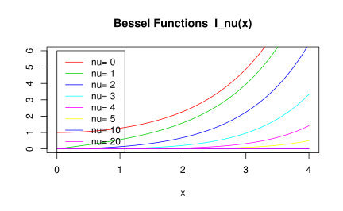

# 数学运算 {#math-operator}


统计计算之矩阵运算，自然离不开 **Matrix** 包 [@R-Matrix]

## 矩阵运算


```r
A <- matrix(c(1, 2, 2, 3), nrow = 2)
A
#>      [,1] [,2]
#> [1,]    1    2
#> [2,]    2    3
```

### 乘法


```r
A %*% A
#>      [,1] [,2]
#> [1,]    5    8
#> [2,]    8   13
```

### Hadamard 积 {#Hadamard}

矩阵每个元素平方


```r
A^2
#>      [,1] [,2]
#> [1,]    1    4
#> [2,]    4    9
```

### 交叉积


```r
crossprod(A, A)  #  t(x) %*% y
#>      [,1] [,2]
#> [1,]    5    8
#> [2,]    8   13
tcrossprod(A, A) #  x %*% t(y)
#>      [,1] [,2]
#> [1,]    5    8
#> [2,]    8   13
```

### 外积


```r
A %o% A
#> , , 1, 1
#> 
#>      [,1] [,2]
#> [1,]    1    2
#> [2,]    2    3
#> 
#> , , 2, 1
#> 
#>      [,1] [,2]
#> [1,]    2    4
#> [2,]    4    6
#> 
#> , , 1, 2
#> 
#>      [,1] [,2]
#> [1,]    2    4
#> [2,]    4    6
#> 
#> , , 2, 2
#> 
#>      [,1] [,2]
#> [1,]    3    6
#> [2,]    6    9
outer(A, A, FUN = "*")
#> , , 1, 1
#> 
#>      [,1] [,2]
#> [1,]    1    2
#> [2,]    2    3
#> 
#> , , 2, 1
#> 
#>      [,1] [,2]
#> [1,]    2    4
#> [2,]    4    6
#> 
#> , , 1, 2
#> 
#>      [,1] [,2]
#> [1,]    2    4
#> [2,]    4    6
#> 
#> , , 2, 2
#> 
#>      [,1] [,2]
#> [1,]    3    6
#> [2,]    6    9
```

### 直积

直积/克罗内克积


```r
A %x% A
#>      [,1] [,2] [,3] [,4]
#> [1,]    1    2    2    4
#> [2,]    2    3    4    6
#> [3,]    2    4    3    6
#> [4,]    4    6    6    9
kronecker(A, A, FUN = "*")
#>      [,1] [,2] [,3] [,4]
#> [1,]    1    2    2    4
#> [2,]    2    3    4    6
#> [3,]    2    4    3    6
#> [4,]    4    6    6    9
```

### 乘方

矩阵 A 首先是一个方阵，对称性和正定性未知，n 个 矩阵 A 相乘

统计之都论坛讨论如何求矩阵的乘方 <https://d.cosx.org/d/5619-svd>

```r
"%^%" <- function(mat, pow) {
  if (!is.matrix(mat)) mat <- as.matrix(mat)
  stopifnot(!diff(dim(mat)))
  if (pow < 0) {
    pow <- -pow
    mat <- solve(mat)
  }
  pow <- round(pow)
  switch(pow + 1, return(diag(1, nrow(mat))), return(mat))
  get.exponents <- function(pow)
    if (pow == 0) NULL else c(k <- 2^floor(log2(pow)), get.exponents(pow - k))
  ans <- diag(nrow(mat))
  dlog2exp <- rev(-diff(c(log2(get.exponents(pow)), 0)))
  for (j in 1:length(dlog2exp)) {
    if (dlog2exp[j]) for (i in 1:dlog2exp[j]) mat <- mat %*% mat
    ans <- ans %*% mat
  }
  ans
}
```

奇异值分解

```r
s <- svd(A)
all.equal(s$u%*%diag(s$d)%*%t(s$v),A)
```

特征值及分解 $A = V \Lambda V^{-1}$ 求解矩阵 A 的 n 次方


```r
eigen(A)
#> eigen() decomposition
#> $values
#> [1]  4.236 -0.236
#> 
#> $vectors
#>       [,1]   [,2]
#> [1,] 0.526 -0.851
#> [2,] 0.851  0.526

eigen(A)$vectors %*% diag(eigen(A)$values) %*% solve(eigen(A)$vectors)
#>      [,1] [,2]
#> [1,]    1    2
#> [2,]    2    3
eigen(A)$vectors %*% diag(eigen(A)$values)^3 %*% solve(eigen(A)$vectors)
#>      [,1] [,2]
#> [1,]   21   34
#> [2,]   34   55
A %*% A %*% A
#>      [,1] [,2]
#> [1,]   21   34
#> [2,]   34   55
```

### 幂


```r
2^A
#>      [,1] [,2]
#> [1,]    2    4
#> [2,]    4    8
exp(A)
#>      [,1]  [,2]
#> [1,] 2.72  7.39
#> [2,] 7.39 20.09
```

### 行列式


```r
det(A)
#> [1] -1
```

### 逆


```r
solve(A)
#>      [,1] [,2]
#> [1,]   -3    2
#> [2,]    2   -1
```

应用之线性方程组


```r
B <- Hilbert(6)
b <- rowSums(B)
# not inv
solve(B,b) 
#> 6 x 1 Matrix of class "dgeMatrix"
#>      [,1]
#> [1,]    1
#> [2,]    1
#> [3,]    1
#> [4,]    1
#> [5,]    1
#> [6,]    1

# inv
solve(B) %*% b
#> 6 x 1 Matrix of class "dgeMatrix"
#>      [,1]
#> [1,]    1
#> [2,]    1
#> [3,]    1
#> [4,]    1
#> [5,]    1
#> [6,]    1
```


Moore-Penrose generalized inverse 广义逆，如果 A 可逆则，广义逆就是逆


```r
library(MASS)
ginv(A)
#>      [,1] [,2]
#> [1,]   -3    2
#> [2,]    2   -1
A %*% ginv(A) %*% A
#>      [,1] [,2]
#> [1,]    1    2
#> [2,]    2    3
ginv(A) %*% A %*% ginv(A)
#>      [,1] [,2]
#> [1,]   -3    2
#> [2,]    2   -1
t(A %*% ginv(A))
#>           [,1]     [,2]
#> [1,]  1.00e+00 8.88e-16
#> [2,] -8.88e-16 1.00e+00
A %*% ginv(A)
#>          [,1]      [,2]
#> [1,] 1.00e+00 -8.88e-16
#> [2,] 8.88e-16  1.00e+00
t(ginv(A) %*% A)
#>          [,1]      [,2]
#> [1,] 1.00e+00 -8.88e-16
#> [2,] 8.88e-16  1.00e+00
ginv(A) %*% A
#>           [,1]     [,2]
#> [1,]  1.00e+00 8.88e-16
#> [2,] -8.88e-16 1.00e+00
```

`ginv` 函数实现

```r
# The function is currently defined as
function(X, tol = sqrt(.Machine$double.eps))
{
## Generalized Inverse of a Matrix
  dnx <- dimnames(X)
  if(is.null(dnx)) dnx <- vector("list", 2)
  s <- svd(X)
  nz <- s$d > tol * s$d[1]
  structure(
    if(any(nz)) s$v[, nz] %*% (t(s$u[, nz])/s$d[nz]) else X,
    dimnames = dnx[2:1])
}
```

### 伴随矩阵

伴随矩阵 $A*A^{\star} = A^{\star} *A = |A|*I, A^{\star} = |A|*A^{-1}$

- $|A^{\star}| = |A|^{n-1}, A \in \mathbb{R}^{n\times n},n \geq 2$
- $(A^{\star})^{\star} = |A|^{n-2}A, A \in \mathbb{R}^{n\times n},n \geq 2$
- $(A^{\star})^{\star}$ A 的 n 次伴随是？


```r
det(A)*solve(A)
#>      [,1] [,2]
#> [1,]    3   -2
#> [2,]   -2    1
```

### 单位矩阵


```r
diag(rep(3))
#>      [,1] [,2] [,3]
#> [1,]    1    0    0
#> [2,]    0    1    0
#> [3,]    0    0    1
```

全1矩阵，借助外积运算，如3阶矩阵


```r
rep(1,3) %o% rep(1,3) 
#>      [,1] [,2] [,3]
#> [1,]    1    1    1
#> [2,]    1    1    1
#> [3,]    1    1    1
```


### 对角矩阵


```r
diag(A)       # diagonal of a matrix
#> [1] 1 3
diag(diag(A)) # construct a diagonal matrix
#>      [,1] [,2]
#> [1,]    1    0
#> [2,]    0    3
```

### 条件数


```r
base::rcond(A)
#> [1] 0.04
kappa(A)
#> [1] 21.9
Matrix::rcond(Hilbert(6))
#> [1] 3.44e-08
Matrix::rcond(A)
#> [1] 0.04
```

### 范数

向量和矩阵的范数，包括1，2，无穷范数，其他操作看 Matrix 包 [@R-Matrix] ，尤其关于稀疏矩阵计算部分


```r
norm(A)
#> [1] 5
```

### 秩


```r
qr(A)$rank # or qr.default(A)$rank
#> [1] 2
```

## 矩阵分解

### Cholesky 分解


```r
# Compute the Choleski factorization of a real symmetric positive-definite square matrix.
chol(A + diag(rep(1,2)))
#>      [,1] [,2]
#> [1,] 1.41 1.41
#> [2,] 0.00 1.41
# Inverse from Choleski (or QR) Decomposition
Matrix::chol2inv(A + diag(rep(1,2)))
#>         [,1]    [,2]
#> [1,]  0.3125 -0.0625
#> [2,] -0.0625  0.0625
```


### 奇异值及分解


```r
svd(A)
#> $d
#> [1] 4.236 0.236
#> 
#> $u
#>        [,1]   [,2]
#> [1,] -0.526 -0.851
#> [2,] -0.851  0.526
#> 
#> $v
#>        [,1]   [,2]
#> [1,] -0.526  0.851
#> [2,] -0.851 -0.526
svd(A)$d
#> [1] 4.236 0.236
```


### QR分解


```r
qr.default(A)
#> $qr
#>        [,1]   [,2]
#> [1,] -2.236 -3.578
#> [2,]  0.894 -0.447
#> 
#> $rank
#> [1] 2
#> 
#> $qraux
#> [1] 1.447 0.447
#> 
#> $pivot
#> [1] 1 2
#> 
#> attr(,"class")
#> [1] "qr"
qr.X(qr.default(A))
#>      [,1] [,2]
#> [1,]    1    2
#> [2,]    2    3
qr.Q(qr.default(A))
#>        [,1]   [,2]
#> [1,] -0.447 -0.894
#> [2,] -0.894  0.447
qr.R(qr.default(A))
#>       [,1]   [,2]
#> [1,] -2.24 -3.578
#> [2,]  0.00 -0.447
qr.Q(qr.default(A)) %*% qr.R(qr.default(A))
#>      [,1] [,2]
#> [1,]    1    2
#> [2,]    2    3
```


LU 分解、Jordan分解


矩阵下三角

row 和 col


```r
row(A)
#>      [,1] [,2]
#> [1,]    1    1
#> [2,]    2    2
col(A)
#>      [,1] [,2]
#> [1,]    1    2
#> [2,]    1    2
A[row(A)]
#> [1] 1 3
```


```r
lower.tri(A)
#>       [,1]  [,2]
#> [1,] FALSE FALSE
#> [2,]  TRUE FALSE
upper.tri(A) # 矩阵上三角
#>       [,1]  [,2]
#> [1,] FALSE  TRUE
#> [2,] FALSE FALSE
A[lower.tri(A)]
#> [1] 2
A[lower.tri(A)] <- 0 # 获得上三角矩阵
A
#>      [,1] [,2]
#> [1,]    1    2
#> [2,]    0    3
A[row(A) < col(A)] <- 0
A
#>      [,1] [,2]
#> [1,]    1    0
#> [2,]    0    3
```

- Householder 变换 <https://www.wikiwand.com/en/Householder_transformation>
- Givens 旋转 <https://www.wikiwand.com/en/Givens_rotation>
- 帽子矩阵在统计中的应用 回归与方差分析 [@David1978Hat]


## 特殊函数

### 阶乘

- 阶乘 $n! = 1\times 2\times 3\cdots n$ 
- 双阶乘 $(2n+1)!! = 1 \times 3\times 5 \times \cdots \times (2n+1), n = 0,1,2,\cdots$


```r
factorial(5) # 阶乘
#> [1] 120
seq(from = 1, to = 5, length.out = 3)
#> [1] 1 3 5
prod(seq(from = 1, to = 5, length.out = 3)) # 连乘 双阶乘
#> [1] 15

seq(5)
#> [1] 1 2 3 4 5
cumprod(seq(5)) # 累积
#> [1]   1   2   6  24 120
cumsum(seq(5)) # 累和
#> [1]  1  3  6 10 15
```

此外还有 `cummax` 和 `cummin`

- 组合数 $C_{n}^{k} = \frac{n(n-1)…(n-k+1)}{k!}$

$C_{5}^{3} = \frac{5 \times 4 \times 3}{3 \times 2 \times 1}$


```r
choose(5,3)
#> [1] 10
```

> 斯特林公式

### 伽马函数

$\Gamma(x) = \int_{0}^{\infty} t^{x-1}\exp(-t)dt$
$\Gamma(n) = (n-1)!, n \in \mathbb{Z}^{+}$


```r
gamma(2)
#> [1] 1
gamma(10)
#> [1] 362880
gamma2 <- function(t,x){
  t^(x-1)*exp(-t)
}
integrate(gamma2, lower = 0, upper = + Inf, x = 10)
#> 362880 with absolute error < 0.025
```

- psigamma(x, deriv) 表示 $\psi(x)$ 的 `deriv` 阶导数

$\mathrm{digamma}(x) \triangleq \psi(x) = \frac{d}{dx}{\ln \Gamma(x)} = \Gamma'(x) / \Gamma(x)$


```r
# 例1
x <- 2
eval(deriv(~ gamma(x), "x"))/gamma(x)
#> [1] 1
#> attr(,"gradient")
#>          x
#> [1,] 0.423
# 与此等价
psigamma(2, 0)
#> [1] 0.423

digamma(x) # psi(x) 的一阶导数
#> [1] 0.423
trigamma(x) # psi(x) 的二阶导数
#> [1] 0.645

# 例2
eval(deriv(~ psigamma(x, 1), "x"))
#> [1] 0.645
#> attr(,"gradient")
#>           x
#> [1,] -0.404
# 与此等价
psigamma(2, 2)
#> [1] -0.404

# 注意与下面这个例子比较
dx2x <- deriv(~ x^3, "x")
eval(dx2x)
#> [1] 8
#> attr(,"gradient")
#>       x
#> [1,] 12
```

### 贝塔函数

$B(a,b) = \Gamma(a)\Gamma(b)/\Gamma(a+b) = \int_{0}^{1} t^{a-1} (1-t)^{b-1} dt$


```r
beta(1, 1)
#> [1] 1
beta(2, 3)
#> [1] 0.0833
beta2 <- function(t, a, b) {
  t^(a - 1) * (1 - t)^(b - 1)
}
integrate(beta2, lower = 0, upper = 1, a = 2, b = 3)
#> 0.0833 with absolute error < 9.3e-16
```

### 贝塞尔函数

```r
besselI(x, nu, expon.scaled = FALSE) # 修正的第一类
besselK(x, nu, expon.scaled = FALSE) # 修正的第二类
besselJ(x, nu) # 第一类
besselY(x, nu) # 第二类
```

- $\nu$ 贝塞尔函数的阶，可以是分数
- expon.scaled 是否使用指数表示


```r
nus <- c(0:5, 10, 20)
x <- seq(0, 4, length.out = 501)
plot(x, x, ylim = c(0, 6), ylab = "", type = "n",
     main = "Bessel Functions  I_nu(x)")
for(nu in nus) lines(x, besselI(x, nu = nu), col = nu + 2)
legend(0, 6, legend = paste("nu=", nus), col = nus + 2, lwd = 1)
```



## 统计分布 {#distribution}


### 一元分布

三大抽样及其历史

### 多元分布

多元t分布函数

The multivariate $t$ distribution (MVT) is given by

$$T(\mathbf{a},\mathbf{b},\Sigma,\nu)=\frac{2^{1-\frac{\nu}{2}}}{\Gamma(\frac{\nu}{2}) } \int_{0}^{\infty} s^{\nu-1}e^{-\frac{s^2}{2}} \Phi(\frac{s\mathbf{a}}{\sqrt{\nu}},\frac{s\mathbf{b}}{\sqrt{\nu}},\Sigma)ds$$

multivariate normal distribution function (MVN)

$$\Phi(\mathbf{a},\mathbf{b},\Sigma)=\frac{1}{\sqrt{|\Sigma|(2\pi)^m}} \int_{a_1}^{b_1}\!\int_{a_2}^{b_2}\!\cdots\!\int_{a_m}^{b_m} e^{-\frac{1}{2}x^\top\Sigma^{-1}x}dx$$
$x=(x_1,x_2,\dots,x_m)^\top,-\infty \le a_i \le b_i \le \infty$ for all $i$ and $\Sigma$ is a positive semi-definite symmetric $m \times m$ matrix

多元$t$分布分位数计算

```r
library(mvtnorm)
library(matrixcalc)
n <- c(26, 24, 20, 33, 32)
V <- diag(1 / n)
df <- 130
C <- matrix(c(
  1, 1, 1, 0, 0, -1, 0, 0, 1, 0,
  0, -1, 0, 0, 1, 0, 0, 0, -1, -1,
  0, 0, -1, 0, 0
), ncol = 5)
cv <- C %*% V %*% t(C) ## covariance matrix
dv <- t(1 / sqrt(diag(cv)))
cr <- cv * (t(dv) %*% dv) ## correlation matrix
delta <- rep(0, 5)
Tn <- qmvt(0.95,
  df = df, delta = delta, corr = cr,
  abseps = 0.0001, maxpts = 100000, tail = "both"
)
Tn
```

计算多元正态分布的概率

```r
sigma <- read.csv(file = "data/sigma.csv", header = F, sep = ",")
mat <- matrix(0, nrow = nrow(sigma), ncol = ncol(sigma))
sigma <- as.matrix(sigma)
attributes(sigma) <- attributes(mat)
# str(sigma)
# is.symmetric.matrix(sigma)
# is.positive.definite(sigma)
m <- nrow(sigma)
Fn <- pmvnorm(
  lower = rep(-Inf, m), upper = rep(0, m),
  mean = rep(0, m), sigma = sigma
)
Fn
```

mvrnorm 函数来自 MASS 包，模拟多元正态分布的样本


