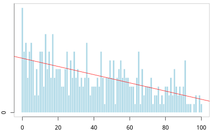
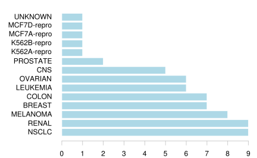
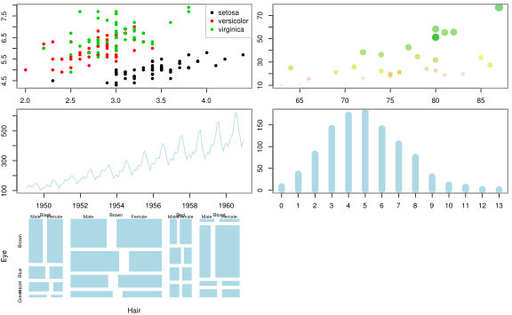
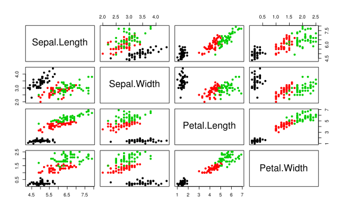
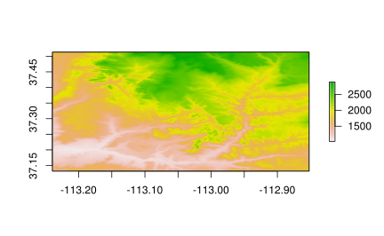
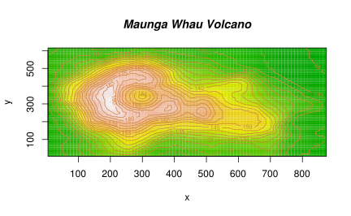

# 基础图形 {#graphics}


## plot {#base}


```r
set.seed(2018) 
n <- 2^16
x <- runif(n,0,1)
delta <- 0.01
len <- diff(c(0,which(x < delta),n+1))-1
ylim <- seq( 0, 1800, by = 300)
xlim <- seq( 0, 100, by = 20)
p <- hist(len[len < 101], breaks = -1:100+0.5, plot = FALSE)
par(mar = c(2,2,.5,.5))
plot(p, xlab = '间距', ylab = '频数', axes = FALSE, 
     col = "lightblue", border = "white", main = "")	 
axis( 1, labels = xlim, at = xlim, las = 1) # x 轴
axis( 2, labels = ylim, at = ylim, las = 0) # y 轴
box(col="gray")
# 添加线性回归线
xx <- seq.int(from = 0, to = 100, by = 1)
xy <- p$counts
options(digits = 2)
fit <- lm(xy~xx)
abline(fit, col = 'red')
```

<div class="figure" style="text-align: center">

<p class="caption">(\#fig:run-length-hist)游程直方图</p>
</div>

```r
b = coef(fit)
# mtext(paste0( "Y = ", paste0(paste0(b[1], b[2]),"x") ), side = 3, cex = 2)
```

还你一个清爽的世界，统计之都文章 [漫谈条形图](https://cosx.org/2017/10/discussion-about-bar-graph/)


```r
data(NCI60, package = "ISLR") # 加载数据
myData <- sort(table(NCI60$labs), decreasing = TRUE)
par(mar = c(2, 7, 1, 1))
barCenters <- barplot(myData,
  col = "lightblue", axes = FALSE,
  axisnames = FALSE, horiz = TRUE, border = "white"
)
text(
  y = barCenters, x = par("usr")[3],
  adj = 1, labels = names(myData), xpd = TRUE
)
axis(1, labels = seq(0, 9, by = 1), at = seq(0, 9, by = 1), las = 1, col = "gray")
```

<div class="figure" style="text-align: center">

<p class="caption">(\#fig:beautiful-barplot)条形图</p>
</div>

plot 作为一个泛型函数，对于不同的输入数据类型，会自动匹配不同的绘图函数，默认的有


```r
methods(plot)
#>  [1] plot.acf*           plot.data.frame*    plot.decomposed.ts*
#>  [4] plot.default        plot.dendrogram*    plot.density*      
#>  [7] plot.ecdf           plot.factor*        plot.formula*      
#> [10] plot.function       plot.hclust*        plot.histogram*    
#> [13] plot.HoltWinters*   plot.isoreg*        plot.lm*           
#> [16] plot.medpolish*     plot.mlm*           plot.ppr*          
#> [19] plot.prcomp*        plot.princomp*      plot.profile.nls*  
#> [22] plot.raster*        plot.spec*          plot.stepfun       
#> [25] plot.stl*           plot.table*         plot.ts            
#> [28] plot.tskernel*      plot.TukeyHSD*     
#> see '?methods' for accessing help and source code
```


```r
op <- par(mfrow = c(3, 2), mar = c(2, 2, .5, .5))
# 分类散点图
plot(Sepal.Length ~ Sepal.Width, data = iris, col = Species, pch = 16)
legend("topright",
  legend = unique(iris$Species), box.col = "gray",
  pch = 16, col = unique(iris$Species)
)
box(col = "gray")
# 气泡图
plot(Volume ~ Height,
  data = trees, pch = 16, cex = Girth / 8,
  col = rev(terrain.colors(nrow(trees), alpha = .5))
)
box(col = "gray")
# 折线图
plot(AirPassengers, col = "lightblue")
box(col = "gray")

# 柱形图
set.seed(123456)
barPois <- table(stats::rpois(1000, lambda = 5))
plot(barPois, col = "lightblue", type = "h", lwd = 10, main = "")
box(col = "gray")

# 马赛克图
# par(mar=c(2,2,.5,.5))
plot(HairEyeColor, col = "lightblue", border = "white", main = "")
# box(col="gray")
# 矩阵图 自带 layout
plot(iris[, -5], col = iris$Species, pch = 16)
```

<div class="figure" style="text-align: center">

<p class="caption">(\#fig:nice-plot)丰富的方法</p>
</div><div class="figure" style="text-align: center">

<p class="caption">(\#fig:nice-plot)丰富的方法</p>
</div>

```r
par(op)
```

raster 图形


```r
library(raster)
#> Loading required package: sp
library(sp)
library(spDataLarge)
plot(elevation, asp = NA)
```

<div class="figure" style="text-align: center">

<p class="caption">(\#fig:unnamed-chunk-3)raster 图形</p>
</div>

注意与 image 函数区别


```r
# A prettier display of the volcano
x <- 10*(1:nrow(volcano))
y <- 10*(1:ncol(volcano))
image(x, y, volcano, col = terrain.colors(100), axes = FALSE)
contour(x, y, volcano, levels = seq(90, 200, by = 5),
        add = TRUE, col = "peru")
axis(1, at = seq(100, 800, by = 100))
axis(2, at = seq(100, 600, by = 100))
box()
title(main = "Maunga Whau Volcano", font.main = 4)
```

<div class="figure" style="text-align: center">

<p class="caption">(\#fig:unnamed-chunk-4)image 图形</p>
</div>

残差图

```
# iris$Species 分三类

vec_mean <- apply(iris[,-5],2,mean)
vec_sd <- apply(iris[,-5],2,sd)

plot( seq(4) , vec_mean,
    ylim = range(c(vec_mean-vec_sd, vec_mean + vec_sd)),
    pch=19, xlab="Species", ylab="Mean +/- SD",
    main="Scatter plot with std.dev error bars"
)

arrows(seq(4), vec_mean-vec_sd, seq(4),  vec_mean + vec_sd, length=0.05, angle=90, code=3)
# seq( nlevels(iris$Species) )
```
