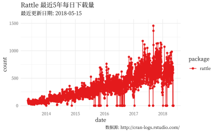
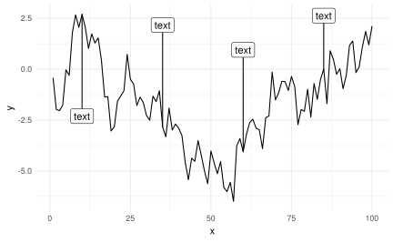

# 高级图形 {#ggplot}


- Claus O. Wilke 新书：数据可视化基础 [Fundamentals of Data Visualization](http://serialmentor.com/dataviz/) 全 R/ggplot2 实现


ggplot2 有很多绘图函数


```r
library(ggplot2)
# packageDescription("ggplot2")
grep('^(geom_)', ls('package:ggplot2'), value = TRUE)
#>  [1] "geom_abline"     "geom_area"       "geom_bar"       
#>  [4] "geom_bin2d"      "geom_blank"      "geom_boxplot"   
#>  [7] "geom_col"        "geom_contour"    "geom_count"     
#> [10] "geom_crossbar"   "geom_curve"      "geom_density"   
#> [13] "geom_density_2d" "geom_density2d"  "geom_dotplot"   
#> [16] "geom_errorbar"   "geom_errorbarh"  "geom_freqpoly"  
#> [19] "geom_hex"        "geom_histogram"  "geom_hline"     
#> [22] "geom_jitter"     "geom_label"      "geom_line"      
#> [25] "geom_linerange"  "geom_map"        "geom_path"      
#> [28] "geom_point"      "geom_pointrange" "geom_polygon"   
#> [31] "geom_qq"         "geom_qq_line"    "geom_quantile"  
#> [34] "geom_raster"     "geom_rect"       "geom_ribbon"    
#> [37] "geom_rug"        "geom_segment"    "geom_sf"        
#> [40] "geom_smooth"     "geom_spoke"      "geom_step"      
#> [43] "geom_text"       "geom_tile"       "geom_violin"    
#> [46] "geom_vline"
grep('^(stat_)', ls('package:ggplot2'), value = TRUE)
#>  [1] "stat_bin"         "stat_bin_2d"      "stat_bin_hex"    
#>  [4] "stat_bin2d"       "stat_binhex"      "stat_boxplot"    
#>  [7] "stat_contour"     "stat_count"       "stat_density"    
#> [10] "stat_density_2d"  "stat_density2d"   "stat_ecdf"       
#> [13] "stat_ellipse"     "stat_function"    "stat_identity"   
#> [16] "stat_qq"          "stat_qq_line"     "stat_quantile"   
#> [19] "stat_sf"          "stat_smooth"      "stat_spoke"      
#> [22] "stat_sum"         "stat_summary"     "stat_summary_2d" 
#> [25] "stat_summary_bin" "stat_summary_hex" "stat_summary2d"  
#> [28] "stat_unique"      "stat_ydensity"
```

rattle 下载量时序图


```r
library(cranlogs)
library(ggthemes)
pkgs_down <- cran_downloads(package = "rattle", from = Sys.Date() - 365 * 5, to = Sys.Date())
ggplot(pkgs_down, aes(x = date, y = count, colour = package)) +
  geom_line() +
  geom_point(size = 1.5) +
  scale_x_date(date_breaks = "1 year", date_labels = "%Y") +
  ylim(c(0, 1500)) +
  scale_colour_brewer(palette = "Set1") +
  # scale_color_fivethirtyeight("") +
  # theme_fivethirtyeight() +
  labs(
    subtitle = paste("最近更新日期:", Sys.Date()),
    title = "Rattle 最近5年每日下载量",
    caption = " 数据源: http://cran-logs.rstudio.com/ "
  ) +
  theme_minimal(base_size = 10.54, base_family = "source-han-serif-cn")
```



给线条添加注释和标签，这个功能有时候比图例更加漂亮


```r
# 出自 https://gist.github.com/EmilHvitfeldt/acb849a6135a21426c260850cf0f461b
# Horizontal annotations with ggrepel and ggplot2
library(tidyverse)
#> ── Attaching packages ────────────────────────────────── tidyverse 1.2.1 ──
#> ✔ tibble  1.4.2     ✔ purrr   0.2.4
#> ✔ tidyr   0.8.0     ✔ dplyr   0.7.4
#> ✔ readr   1.1.1     ✔ stringr 1.3.1
#> ✔ tibble  1.4.2     ✔ forcats 0.3.0
#> ── Conflicts ───────────────────────────────────── tidyverse_conflicts() ──
#> ✖ dplyr::filter() masks stats::filter()
#> ✖ dplyr::lag()    masks stats::lag()
#> ✖ dplyr::vars()   masks ggplot2::vars()
library(ggrepel)
data <- tibble(
  x = seq_len(100),
  y = cumsum(rnorm(100))
)

anno_data <- data %>%
  filter(x %% 25 == 10) %>%
  mutate(text = "text")

data %>%
  ggplot(aes(x, y)) +
  geom_line() +
  geom_label_repel(aes(label = text),
    data = anno_data,
    direction = "y",
    nudge_y = c(-5, 5, 5, 5)
  ) +
  theme_minimal()
```

<div class="figure" style="text-align: center">

<p class="caption">(\#fig:add-label-ggrepel)添加标签</p>
</div>


本节软件信息


```r
devtools::session_info("ggplot2")
#> Session info -------------------------------------------------------------
#>  setting  value                       
#>  version  R version 3.4.4 (2017-01-27)
#>  system   x86_64, linux-gnu           
#>  ui       X11                         
#>  language (EN)                        
#>  collate  en_US.UTF-8                 
#>  tz       UTC                         
#>  date     2018-05-15
#> Packages -----------------------------------------------------------------
#>  package      * version    date       source                            
#>  assertthat     0.2.0      2017-04-11 CRAN (R 3.3.3)                    
#>  cli            1.0.0      2017-11-05 CRAN (R 3.4.2)                    
#>  colorspace     1.3-2      2016-12-14 CRAN (R 3.4.0)                    
#>  crayon         1.3.4      2017-09-16 CRAN (R 3.4.1)                    
#>  dichromat      2.0-0      2013-01-24 CRAN (R 3.0.1)                    
#>  digest         0.6.15     2018-01-28 CRAN (R 3.4.3)                    
#>  ggplot2      * 2.2.1.9000 2018-05-15 Github (tidyverse/ggplot2@daba7ab)
#>  glue           1.2.0      2017-10-29 CRAN (R 3.4.2)                    
#>  graphics     * 3.4.4      2018-03-15 local                             
#>  grDevices    * 3.4.4      2018-03-15 local                             
#>  grid           3.4.4      2018-03-15 local                             
#>  gtable         0.2.0      2016-02-26 CRAN (R 3.2.3)                    
#>  labeling       0.3        2014-08-23 CRAN (R 3.1.1)                    
#>  lattice        0.20-35    2017-03-25 CRAN (R 3.4.4)                    
#>  lazyeval       0.2.1      2017-10-29 CRAN (R 3.4.2)                    
#>  magrittr       1.5        2014-11-22 CRAN (R 3.1.2)                    
#>  MASS           7.3-49     2018-02-23 CRAN (R 3.4.4)                    
#>  Matrix         1.2-12     2017-11-30 CRAN (R 3.4.4)                    
#>  methods      * 3.4.4      2018-03-15 local                             
#>  mgcv           1.8-23     2018-01-21 CRAN (R 3.4.4)                    
#>  munsell        0.4.3      2016-02-13 CRAN (R 3.2.3)                    
#>  nlme           3.1-131.1  2018-02-16 CRAN (R 3.4.4)                    
#>  pillar         1.2.2      2018-04-26 CRAN (R 3.4.4)                    
#>  plyr           1.8.4      2016-06-08 CRAN (R 3.4.0)                    
#>  R6             2.2.2      2017-06-17 CRAN (R 3.4.0)                    
#>  RColorBrewer   1.1-2      2014-12-07 CRAN (R 3.1.2)                    
#>  Rcpp           0.12.16    2018-03-13 CRAN (R 3.4.4)                    
#>  reshape2       1.4.3      2017-12-11 CRAN (R 3.4.3)                    
#>  rlang          0.2.0      2018-02-20 CRAN (R 3.4.3)                    
#>  scales         0.5.0      2017-08-24 CRAN (R 3.4.1)                    
#>  stats        * 3.4.4      2018-03-15 local                             
#>  stringi        1.2.2      2018-05-02 CRAN (R 3.4.4)                    
#>  stringr      * 1.3.1      2018-05-10 CRAN (R 3.4.4)                    
#>  tibble       * 1.4.2      2018-01-22 CRAN (R 3.4.3)                    
#>  tools          3.4.4      2018-03-15 local                             
#>  utf8           1.1.3      2018-01-03 CRAN (R 3.4.3)                    
#>  utils        * 3.4.4      2018-03-15 local                             
#>  viridisLite    0.3.0      2018-02-01 CRAN (R 3.4.3)                    
#>  withr          2.1.2      2018-03-15 CRAN (R 3.4.4)
```

