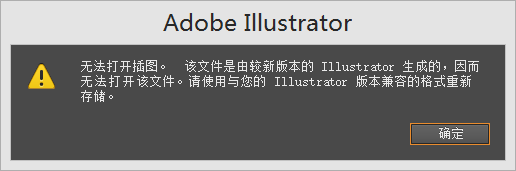
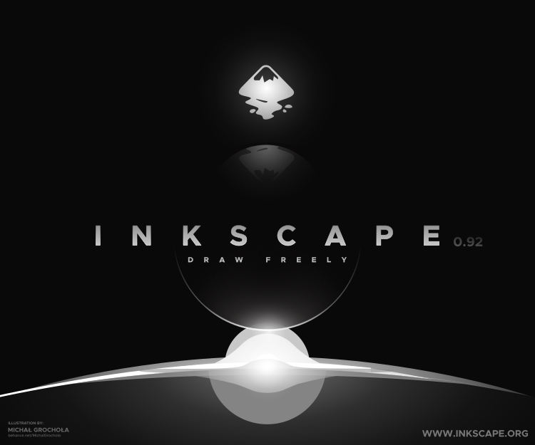
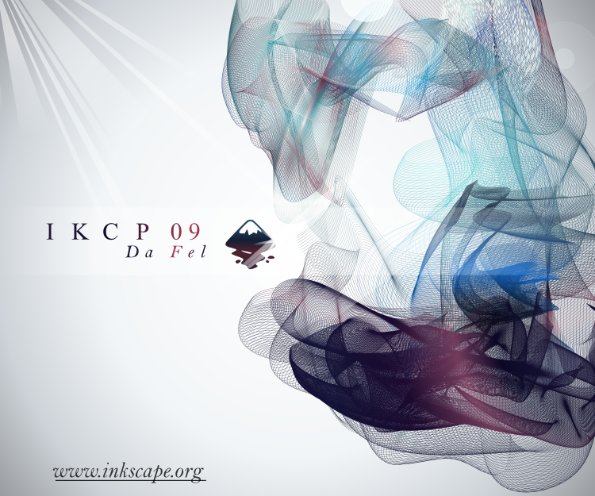
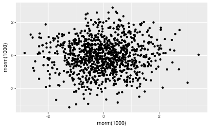

# 绘图工具


图片导入，导出，转化，批量转化

导入 SVG 格式的图片, rsvg [@R-rsvg] 批量转化 svg 文件为 pdf 文件

```r
library(rsvg)
tmp <- "figure/Ink" # svgs 存放目录
input_paths <- paste0(tmp, "/", list.files(tmp))
output_paths <- paste0("figure/pdf", "/", gsub("svg", "pdf", list.files(tmp)))

for (i in seq(length(list.files(tmp)))) {
  rsvg_pdf(input_paths[i], file = output_paths[i])
}
```

- pdftools [@R-pdftools] 用于文本提取，渲染和转化 PDF 文档

- magick 的简单使用，如插入 Inkscape 图标，如图\@ref(fig:inkscape-logo)

<div class="figure" style="text-align: center">

<p class="caption">(\#fig:inkscape-logo)Inkscape 图标</p>
</div>

[magick](https://github.com/ropensci/magick) Bindings to ImageMagick: the most comprehensive open-source image processing library available. Supports many common formats (png, jpeg, tiff, pdf, etc) and manipulations (rotate, scale, crop, trim, flip, blur, etc). All operations are vectorized via the Magick++ STL meaning they operate either on a single frame or a series of frames for working with layers, collages, or animation. In RStudio images are automatically previewed when printed to the console, resulting in an interactive editing environment. The latest version of the package includes a native graphics device for creating in-memory graphics or drawing onto images using pixel coordinates.


## 截图

- webshot <https://github.com/wch/webshot>

```r
# 截图
install.packages("webshot")
webshot::install_phantomjs()
# 截网页
library(webshot)
webshot("https://www.r-project.org/", "r.png")
webshot("https://www.r-project.org/", "r.pdf") # Can also output to PDF
# 截文档
rmdshot("document.rmd", "document.png")
# 截特定大小 GraphicsMagick (recommended) or ImageMagick installed
# Can specify pixel dimensions for resize()
webshot("https://www.r-project.org/", "r-small.png") %>%
  resize("400x") %>%
  shrink()
```


## Inkscape

Inkscape is an open source drawing tool with capabilities similar to Illustrator, Freehand, and CorelDraw that uses the W3C standard scalable vector graphics  format (SVG). Some supported SVG features include basic shapes, paths, text, markers, clones, alpha blending, transforms, gradients, and grouping. In addition, Inkscape supports Creative Commons meta-data, node-editing, layers, complex path operations, text-on-path, and SVG XML editing. It also imports several formats like EPS, Postscript, JPEG, PNG, BMP, and TIFF and exports PNG as well as multiple vector-based formats.

Inkscape's main motivations are to provide the Open Source community with a fully W3C compliant XML, SVG, and CSS2 drawing tool emphasizing a lightweight core with powerful features added as extensions, and the establishment of a friendly, open, community-oriented development processes.

Inkscape^[<https://inkscape.org/zh/>] 是替代 Adobe Illustrator（简称 AI） 最佳工具，没有之一。开源免费，功能齐全，更新快，跨平台。尤其不用面临如图\@ref(fig:ai-error)所示的兼容性问题，说白了，就是厂家在不停地刷版本号，要用户掏钱升级，我早年间也是 Adobe 的忠实粉丝，通过校园先锋以学生身份买了好几套产品，后来看透了这一切，又找到了开源的 Inkscape \index{Inkscape}，现在我没有理由去升级 AI 了，我的电脑现在装的还都是 CS6 系列。

<div class="figure" style="text-align: center">

<p class="caption">(\#fig:ai-error)兼容性错误</p>
</div>

最后欣赏来自官网的几个作品^[图片来自 <https://inkscape.org/en/gallery/>]

<div class="figure" style="text-align: center">

<p class="caption">(\#fig:ink-work)作品欣赏</p>
</div><div class="figure" style="text-align: center">

<p class="caption">(\#fig:ink-work)作品欣赏</p>
</div>


## 转化

首先安装 ImageMagick 软件包中的 covert 程序

```bash
asy -f jpg test.asy
```

高质量大图，给定像素

```
convert -geometry 1000x3000 example.eps example.png
```

指定分辨率

```
convert -geometry 1000x3000 -density 300 -units PixelsPerInch example.eps example.png
```

这样不改变图像的像素数，只是给出一个每个像素应该显示多大的提示。

## 优化

optipng 是一个非常好的图片压缩、优化工具

现在，我们设置 chunk 选项 `optipng` 为非空(non-`NULL`)的值，例如，`''` 去激活这个 hook （益辉称之为钩子，这里勾的是 optipng 这个图片优化工具）


```r
library(ggplot2)
set.seed(123)
qplot(rnorm(1e3), rnorm(1e3))
```

<div class="figure" style="text-align: center">

<p class="caption">(\#fig:use-optipng)优化</p>
</div>

同一幅图，但是没有优化


```r
library(ggplot2)
set.seed(123)
qplot(rnorm(1e3), rnorm(1e3))
```

<div class="figure" style="text-align: center">

<p class="caption">(\#fig:no-optipng)没有优化</p>
</div>

同一幅图，但是使用最高级别的优化 (传递 `-o7` 参数给 `optipng`):


```r
library(ggplot2)
set.seed(123)
qplot(rnorm(1e3), rnorm(1e3))
```

<div class="figure" style="text-align: center">

<p class="caption">(\#fig:optipng-o7)最强优化</p>
</div>

## 裁剪

pdfcrop 可将 PDF 图片中留白的部分裁去，再也不用纠结 par 了

<div class="figure" style="text-align: center">

<p class="caption">(\#fig:pdfcrop)pdfcrop 裁剪白边</p>
</div>

## 接口

R提供了丰富的图形接口，包括 Tcl/Tk , Gtk, Shiny 等。John Chamber 在书 《Extending R》详细介绍了这一切

rattle/RGtk2: R Bindings for Gtk 2.8.0 and Above <http://www.ggobi.org/rgtk2/>

Rcmdr: tcl/tk

shiny: radiant <https://github.com/radiant-rstats/radiant>

```r
install.packages("radiant", repos = "https://radiant-rstats.github.io/minicran/")
```
