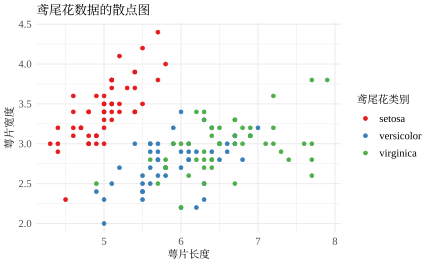
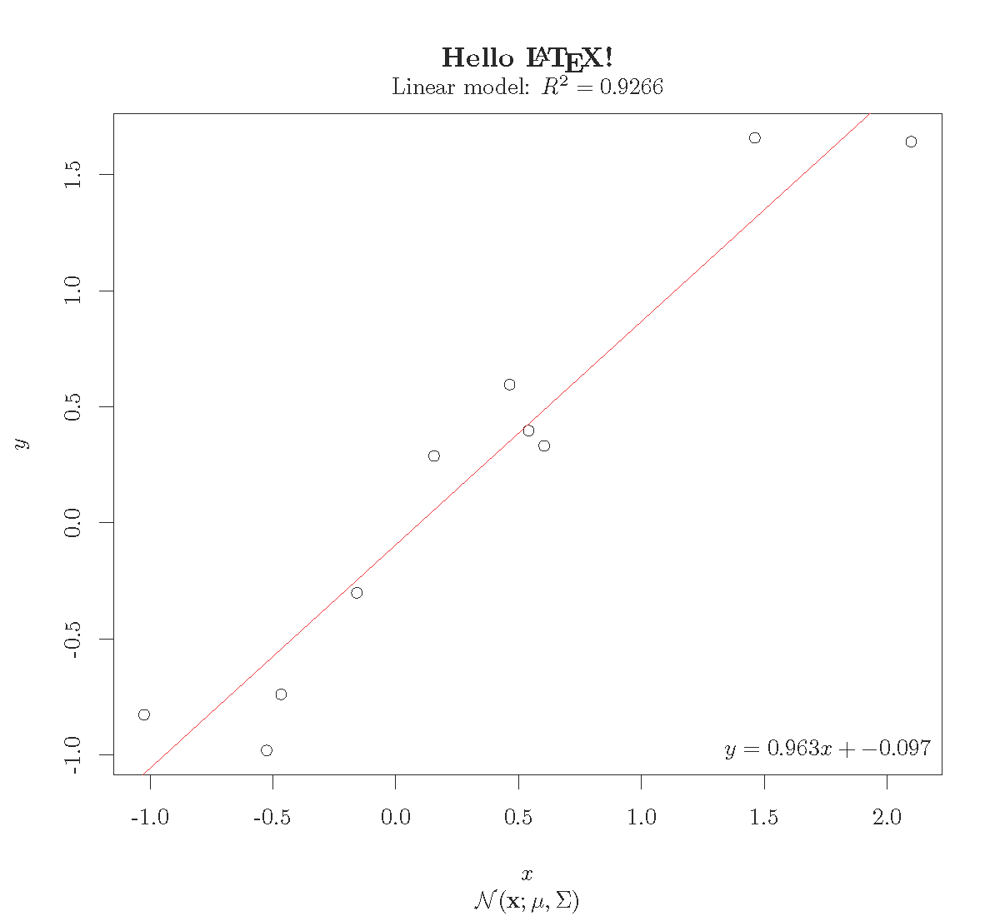
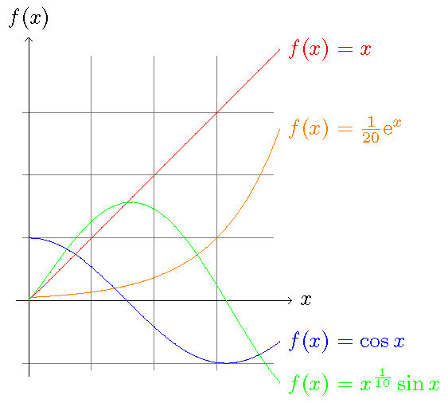

# 字体 {#fonts}


## CJK 字体

windows 下，支持 `pdf`，`cairo_pdf` 和 `svg` 设备，如 `cairo_pdf(file = "cjk.pdf",width=3,height=1)`


```r
library(grid)
grid.text("\u4F60\u597D",
  y = 2 / 3,
  gp = gpar(fontfamily = "CNS1")
)
grid.text(
  "is 'hello' in (Traditional) Chinese",
  y = 1 / 3
)
```

<div class="figure" style="text-align: center">

<p class="caption">(\#fig:cjk)CJK 字体支持</p>
</div>

参考文献 <https://cran.r-project.org/doc/Rnews/Rnews_2006-2.pdf> Non-Standard Fonts in PostScript and PDF Graphics 一节

grDevices 包提供了如下函数，用于 postscript 和 pdf 图形设备，嵌入字体借助了 [Ghostscript](https://www.ghostscript.com/) 其下载地址 <https://github.com/ArtifexSoftware/ghostpdl-downloads/releases/download/gs923/gs923w64.exe>

以及 PDF 阅读器 MuPDF <https://www.mupdf.com/>

```r
postscriptFonts(...)
pdfFonts(...)
embedFonts
```


字体设置包括自定义中文字体、英文字体和数学公式。

> 启用showtext 包处理中文，在网页版文档中，png 图片中的字体会变很小

## showtext 

showtext 包[@Qiu2015]可以调用系统字体，图\@ref(fig:iris-ggplot2)使用5号思源宋体，英文和数字使用 serif 字体。详细的使用文档可以看 [showtext 的开发页面](https://github.com/yixuan/showtext)


```r
library(ggplot2)
ggplot(iris, aes(Sepal.Length, Sepal.Width)) +
  geom_point(aes(colour = Species)) +
  scale_colour_brewer(palette = "Set1") +
  labs(
    title = "鸢尾花数据的散点图",
    x = "萼片长度", y = "萼片宽度", colour = "鸢尾花类别"
  ) +
  theme_minimal(base_size = 10.54, base_family = "source-han-serif-cn") +
  theme(
    legend.text = element_text(family = "serif", size = 10.54),
    axis.text = element_text(family = "serif", size = 10.54)
    )
```

<div class="figure" style="text-align: center">

<p class="caption">(\#fig:iris-ggplot2)showtext包处理图里的中文</p>
</div>

用 ggplot2 画个简单地图，地图数据在 mapdata 包 [@R-mapdata]，如图 \@ref(fig:map-Fiji-earthquake) 所示


```r
library(maps)
library(mapdata)
FijiMap <- map_data("worldHires", region = "Fiji")
ggplot(FijiMap, aes(x = long, y = lat)) +
  geom_map(map = FijiMap, aes(map_id = region), size = .2) +
  geom_point(data = quakes, aes(x = long, y = lat, colour = mag), pch = 16) +
  xlim(160, 195) +
  scale_colour_distiller(palette = "Spectral") +
  scale_y_continuous(breaks = (-18:18) * 5) +
  coord_map("ortho", orientation = c(-10, 180, 0)) +
  labs(colour = "震级", x = "经度", y = "纬度", title = "斐济地震带") +
  theme_minimal() +
  theme(
    title = element_text(family = "source-han-sans-cn"),
    axis.title = element_text(family = "source-han-serif-cn"),
    legend.title = element_text(family = "source-han-sans-cn"),
    legend.position = c(1, 0), legend.justification = c(1, 0)
  )
```

<div class="figure" style="text-align: center">

<p class="caption">(\#fig:map-Fiji-earthquake)斐济地震带</p>
</div>

用 base plot 画地图，如图 \@ref(fig:maps-unemp-plot) 所示


```r
library(mapproj)
data(unemp)
data(county.fips)
colors <- c("#F1EEF6", "#D4B9DA", "#C994C7", "#DF65B0", "#DD1C77", "#980043")
unemp$colorBuckets <- as.numeric(cut(unemp$unemp, c(0, 2, 4, 6, 8, 10, 100)))
leg.txt <- c("<2%", "2-4%", "4-6%", "6-8%", "8-10%", ">10%")
cnty.fips <- county.fips$fips[match(
  map("county", plot = FALSE)$names,
  county.fips$polyname
)]
colorsmatched <- unemp$colorBuckets[match(cnty.fips, unemp$fips)]
par(mar = c(0, 0, 2, 0))
# draw map
map("county",
  col = colors[colorsmatched], fill = TRUE, resolution = 0,
  lty = 0, projection = "polyconic"
)
map("state",
  col = "white", fill = FALSE, add = TRUE, lty = 1, lwd = 0.2,
  projection = "polyconic"
)
title("unemployment by county, 2009")
legend("top", leg.txt, horiz = TRUE, fill = colors)
```

<div class="figure" style="text-align: center">

<p class="caption">(\#fig:maps-unemp-plot)2009年美国各城镇失业率</p>
</div>

## xkcd

这篇文章主要使用 ggplot2 包[@Wickham2016]绘图，为了好玩我们还使用 xkcd 字体，先下载和加载 xkcd 包[@R-xkcd]，它提供一个 gg 风格的图层`theme_xkcd()`，图 \@ref(fig:xkcd-embed) 是一个简单使用 xkcd 字体的例子


```r
library(extrafont)
#> Registering fonts with R
library(xkcd)
ggplot(aes(mpg, wt), data = mtcars) + geom_point() +
    theme_xkcd()
```

<div class="figure" style="text-align: center">

<p class="caption">(\#fig:xkcd-embed)xkcd 风的图</p>
</div>

## fontcm

安装 fontcm 包[@R-fontcm]处理数学公式，下载 fontcm 包^[<https://github.com/wch/fontcm>] 和相关字体，使用 fontcm 包，一个小 demo 如下，这里已经使用 `cairo_pdf` 设备保存图片了，如果用 `pdf` 设备保存会更加难看


```r
library(fontcm)
p <- qplot(c(1, 5), c(1, 5)) +
  xlab("Made with CM fonts") + ylab("Made with CM fonts") +
  ggtitle("Made with CM fonts")
# 公式
eq <- "italic(sum(frac(1, n*'!'), n==0, infinity) ==
       lim(bgroup('(', 1 + frac(1, n), ')')^n, n %->% infinity))"
# 默认字体
p1 <- p + annotate("text", x = 3, y = 3, parse = TRUE, label = eq) # fig 1
# 使用 CM Roman 字体
p2 <- p + annotate("text",
  x = 3, y = 3, parse = TRUE,
  family = "CM Roman", label = eq
) +
  theme(
    text = element_text(size = 16, family = "CM Roman"),
    axis.title.x = element_text(face = "italic"),
    axis.title.y = element_text(face = "bold")
  )
library(gridExtra)
grid.arrange(p1,p2, nrow = 1, ncol = 2)
```

<div class="figure" style="text-align: center">

<p class="caption">(\#fig:fontcm-demo)fontcm 处理数学公式</p>
</div>

使用 ghostscript 对 `pdf` 设备保存的图形嵌入数学字体（此嵌入字体的方法对 `cairo_pdf` 保存的图形无效），最终效果如图 \@ref(fig:fontcm-ggplot) 所示，

```r 
pdf(file = 'figures/ggplot_cm.pdf',width = 8,height = 4)
grid.arrange(p1,p2, nrow = 1, ncol = 2)
dev.off()
# 嵌入字体
extrafont::embed_fonts("figures/ggplot_cm.pdf", outfile = "figures/ggplot_cm_embed.pdf")
```
<div class="figure" style="text-align: center">

<p class="caption">(\#fig:fontcm-ggplot)fontcm 处理数学公式</p>
</div>

## tikzDevice

先测试一下


```r
tikzDevice::tikzTest()
#> 
#> Active compiler:
#> 	/home/travis/texlive/bin/x86_64-linux/xelatex
#> 	XeTeX 3.14159265-2.6-0.99999 (TeX Live 2018)
#> 	kpathsea version 6.3.0
#> Measuring dimensions of: A
#> Running command: '/home/travis/texlive/bin/x86_64-linux/xelatex' -interaction=batchmode -halt-on-error -output-directory '/tmp/Rtmpq3pJhL/tikzDevice764f46351c2e' '/tmp/Rtmpq3pJhL/tikzDevice764f46351c2e/tikzStringWidthCalc.tex'
#> [1] 7.5
```

tikz 源于 LaTeX 宏包，在 R 语言绘图的世界里，对基础图形有很好的支持，如图 \@ref(fig:tikz-demo) 所示，坐标轴标签，标题，图例等位置都支持数学公式，既然含有数学公式，就得设置 `dev = 'tikz'` 和 `fig.ext = 'tex'`，并且只产生 PDF 格式图片，除非研究一个钩子（见 `common.R` 文件），遇到这种情况再将 PDF 转化为 PNG 格式


```r
x <- rnorm(10)
y <- x + rnorm(5, sd = 0.25)
model <- lm(y ~ x)
rsq <- summary(model)$r.squared
rsq <- signif(rsq, 4)
plot(x, y, main = "Hello \\LaTeX!", xlab = "$x$", ylab = "$y$", 
     sub = "$\\mathcal{N}(\\mathbf{x};\\mu,\\Sigma)$")
abline(model, col = "red")
mtext(paste("Linear model: $R^{2}=", rsq, "$"), line = 0.5)
legend("bottomright", legend = paste0("$y = ", 
                                     round(coef(model)[2], 3),
                                     "x +", 
                                     round(coef(model)[1], 3), 
                                     "$"
                                     ), 
       bty = "n")
```

或者单独保存成 pdf 图片和 png 图片，然后插入

<div class="figure" style="text-align: center">

<p class="caption">(\#fig:tikz-demo)tikz 之线性回归</p>
</div>

再把代码贴上


```r
cat(readLines("code/tikz-linear-regression.R", encoding = "UTF-8"), sep = "\n")
#> x <- rnorm(10)
#> y <- x + rnorm(5, sd = 0.25)
#> model <- lm(y ~ x)
#> rsq <- summary(model)$r.squared
#> rsq <- signif(rsq, 4)
#> plot(x, y, main = "Hello \\LaTeX!", xlab = "$x$", ylab = "$y$", 
#>      sub = "$\\mathcal{N}(\\mathbf{x};\\mu,\\Sigma)$")
#> abline(model, col = "red")
#> mtext(paste("Linear model: $R^{2}=", rsq, "$"), line = 0.5)
#> legend("bottomright", legend = paste0("$y = ", 
#>                                       round(coef(model)[2], 3),
#>                                       "x +", 
#>                                       round(coef(model)[1], 3), 
#>                                       "$"
#> ), 
#> bty = "n")
```

虽然复杂图片也可直接用 tikz 制作但是，尺寸等细节不好调整（我还没找到合适的方法），比较合适的做法可能是，独立制作图，然后作为图片插入，以一个颇具复杂度的图片为例，如图 \@ref(fig:plot3d-tikz) 所示


```r
cat(readLines("code/tikz-persp-3d.R", encoding = "UTF-8"), sep = "\n")
#> # 代码来自  http://www.ejwagenmakers.com/misc/Plotting_3d_in_R.pdf
#> # 3-D plots
#> mu1 <- 0 # setting the expected value of x1
#> mu2 <- 0 # setting the expected value of x2
#> s11 <- 10 # setting the variance of x1
#> s12 <- 15 # setting the covariance between x1 and x2
#> s22 <- 10 # setting the variance of x2
#> rho <- 0.5 # setting the correlation coefficient between x1 and x2
#> x1 <- seq(-10, 10, length = 41) # generating the vector series x1
#> x2 <- x1 # copying x1 to x2
#> f <- function(x1, x2) {
#>   term1 <- 1 / (2 * pi * sqrt(s11 * s22 * (1 - rho^2)))
#>   term2 <- -1 / (2 * (1 - rho^2))
#>   term3 <- (x1 - mu1)^2 / s11
#>   term4 <- (x2 - mu2)^2 / s22
#>   term5 <- -2 * rho * ((x1 - mu1) * (x2 - mu2)) / (sqrt(s11) * sqrt(s22))
#>   term1 * exp(term2 * (term3 + term4 - term5))
#> } # setting up the function of the multivariate normal density
#> z <- outer(x1, x2, f) # calculating the density values
#> nrz <- nrow(z)
#> ncz <- ncol(z)
#> # Create a function interpolating colors in the range of specified colors
#> # jet.colors <- colorRampPalette( c("blue", "green") )
#> # Generate the desired number of colors from this palette
#> nbcol <- 100
#> # color <- jet.colors(nbcol)
#> color <- viridisLite::viridis(100)
#> # Compute the z-value at the facet centres
#> zfacet <- z[-1, -1] + z[-1, -ncz] + z[-nrz, -1] + z[-nrz, -ncz]
#> # Recode facet z-values into color indices
#> facetcol <- cut(zfacet, nbcol)
#> # persp 坐标轴标签不支持表达式 ?persp
#> 
#> # 使用 tikzDevice 打造出版级的效果图
#> # library(tikzDevice)
#> # tf <- file.path(getwd(), "figures/binormal.tex")
#> # tikz(tf, width = 6, height = 5.5, pointsize = 30, standAlone = TRUE)
#> op <- par(mar = c(2, 3, 3, 0.5))
#> persp(x1, x2, z,
#>       xlab = "$x_{1}$",
#>       ylab = "$x_{2}$",
#>       zlab = "$f(\\mathsf{x})$",
#>       main = "Two dimensional Normal Distribution",
#>       col = color[facetcol], border = NA, theta = 30, phi = 20,
#>       r = 50, d = 0.1, expand = 0.5, ltheta = 90, lphi = 180,
#>       shade = 0.1, ticktype = "detailed", nticks = 5, box = TRUE
#> ) # produces the 3-D plot
#> # adding a text line to the graph
#> mtext("$\\mu_1 = 0,\\mu_2 = 0,\\sigma_{11} = 10,\\sigma_{22} = 10,\\sigma_{12} = 15, \\rho = 0.5$", side = 3)
#> mtext("$f(\\mathsf{x}) = \\frac{1}{2\\pi\\sqrt{\\sigma_{11}\\sigma_{22}(1-\\rho^2)}}\\exp\\big\\{-\\frac{1}{2(1-\\rho^2)}[\\frac{(x_1 - \\mu_1)^2}{\\sigma_{11}} - 2\\rho\\frac{(x_1 - \\mu_1)(x_2 - \\mu_2)}{\\sqrt{\\sigma_{11}}\\sqrt{\\sigma_{22}}} + \\frac{(x_2 - \\mu_2)^2}{\\sigma_{22}}]\\big\\}$", side = 1)
#> par(op)
#> # dev.off()
#> # tinytex::latexmk(file = "figures/binormal.tex")
```

此外还有一个重要原因，tikz 图形绘制起来比较慢，尤其是线条密集型的图片，这样过于耗时，放在 travis 上编译不合适。如图  \@ref(fig:plot3d-tikz) 

<div class="figure" style="text-align: center">

<p class="caption">(\#fig:plot3d-tikz)tikz 之复杂公式</p>
</div>

## TikZ 和 PGF

如图 \@ref(fig:latex-tikz) 所示，模板存放在 `tikz/tikz2pdf.tex`


```tikz
\begin{tikzpicture}[scale=.7]
\draw [fill=gray!30,very thick] (0,-1) rectangle (5,1);
\draw [very thick] (5, 0) -- (13,0);
\node [below] at (2,-1) {\large Hello};
\node [below, align=center] at (0,-1) {\large Two\\ lines};
\end{tikzpicture}
```

一幅纯 tikz 代码绘制的图形，代码如下


```r
cat(readLines("tikz/mini-demo.tex", encoding = "UTF-8"), sep = "\n")
#> \documentclass[tikz]{standalone}
#> \usepackage{tikz}
#> \begin{document}
#> \begin{tikzpicture}[domain=0:4]
#>   \draw[very thin,color=gray] (-0.1,-1.1) grid (3.9,3.9);
#>   \draw[->] (-0.2,0) -- (4.2,0) node[right] {$x$};
#>   \draw[->] (0,-1.2) -- (0,4.2) node[above] {$f(x)$};
#>   \draw[color=red]     plot (\x,\x)             node[right] {$f(x) =x$};
#>   % \x r 表示弧度
#>   \draw[color=blue]    plot (\x,{cos(\x r)})    node[right] {$f(x) = \cos x$};
#>   \draw[color=green]   plot (\x,{(\x r)^0.1*sin(\x r)})    node[right] {$f(x) = x^{\frac{1}{10}} \sin x$};  
#>   \draw[color=orange]  plot (\x,{0.05*exp(\x)}) node[right] {$f(x) = \frac{1}{20} \mathrm e^x$};
#> \end{tikzpicture}
#> \end{document}
```

<div class="figure" style="text-align: center">

<p class="caption">(\#fig:mini-tikz-demo)一幅迷你 tikz 图形</p>
</div>


```r
par(mar = c(4.5, 4, .1, .1))
hist(rnorm(1000), main='', xlab='$x$ (how the fonts look like here?)',
  ylab='$\\hat{f}(x) = \\frac{1}{nh}\\sum_{i=1}^n \\cdots$')
```

