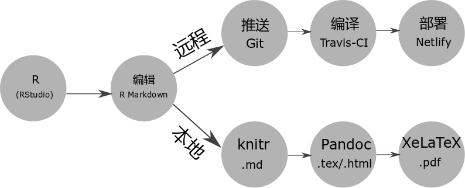

# R Markdown {#pandoc-markdown}

```{r setup,include=FALSE}
Pkgs <- c(
  "kableExtra"
)
if (length(setdiff(Pkgs, .packages(TRUE))) > 0)
  install.packages(setdiff(Pkgs, .packages(TRUE)))
```


- 图片引用

`r if(knitr::is_latex_output()) "如图 \\@ref(fig:id1) 所示"`

{#fig:id1 width=70% }

gitbook 这样网页又该如何引用这张图片呢？

- 表格交叉引用

- 参考文献交叉引用


## bookdown

在指定目录创建 Book 项目，

```r
bookdown:::bookdown_skeleton("~/book")
```

项目根目录的文件列表

```markdown
directory/
├──  index.Rmd
├── 01-intro.Rmd
├── 02-literature.Rmd
├── 03-method.Rmd
├── 04-application.Rmd
├── 05-summary.Rmd
├── 06-references.Rmd
├── _bookdown.yml
├── _output.yml
├──  book.bib
├──  preamble.tex
├──  README.md
└──  style.css
```


## 复杂表格制作

- kableExtra

借助 kableExtra 包 [@R-kableExtra] 可以制作复杂的统计图表，更多的例子请看 <https://github.com/haozhu233/kableExtra> ，我喜欢这个图标设计，如图 \@ref(fig:kableExtra)

```{r kableExtra, echo = FALSE, fig.cap="kableExtra 的徽标",out.width="30%"}
ext <- if (knitr::is_html_output()) ".svg" else if (knitr::is_latex_output()) ".pdf" else ".png"
knitr::include_graphics(path = paste0("diagrams/kableExtra", ext))
```

```{r, eval = knitr::is_html_output(),echo = knitr::is_html_output()}
library(knitr)
library(kableExtra)
dt <- mtcars[1:5, 1:4]

# HTML table
kable(dt, format = "html", caption = "kableExtra 制作") %>%
  kable_styling(bootstrap_options = "striped",
                full_width = F) %>%
  add_header_above(c(" ", "Group 1" = 2, "Group 2[note]" = 2)) %>%
  add_footnote(c("table footnote"))
```

```{r, eval = knitr::is_latex_output(), echo = knitr::is_latex_output()}
library(knitr)
library(kableExtra)
dt <- mtcars[1:5, 1:4]

# LaTeX Table
kable(dt, format = "latex", booktabs = T, caption = "kableExtra 制作") %>%
  kable_styling(latex_options = c("striped", "hold_position"),
                full_width = F) %>%
  add_header_above(c(" ", "Group 1" = 2, "Group 2[note]" = 2)) %>%
  add_footnote(c("table footnote"))
```
