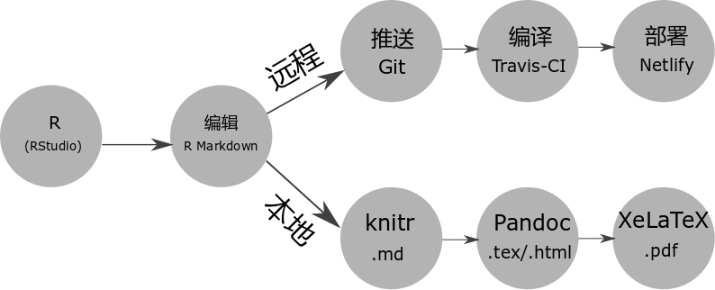

# R Markdown {#pandoc-markdown}

```{r setup,include=FALSE}
Pkgs <- c(
  "kableExtra"
)
if (length(setdiff(Pkgs, .packages(TRUE))) > 0)
  install.packages(setdiff(Pkgs, .packages(TRUE)))
```


- 图片引用

`r if(knitr::is_latex_output()) "如图 \\@ref(fig:id1) 所示"`

{#fig:id1 width=70% }

gitbook 这样网页又该如何引用这张图片呢？

```{r 00-workflow, echo = FALSE, fig.cap="两种编译方式及过程"}
ext <- if (knitr::is_html_output()) ".svg" else if (knitr::is_latex_output()) ".pdf" else ".png"
knitr::include_graphics(path = paste0("diagrams/00-workflow", ext))
```

如图 \@ref(fig:00-workflow) 展示了两种编译方式


- 表格交叉引用

- 参考文献交叉引用


## bookdown

在指定目录创建 Book 项目，

```r
bookdown:::bookdown_skeleton("~/book")
```

项目根目录的文件列表

```markdown
directory/
├──  index.Rmd
├── 01-intro.Rmd
├── 02-literature.Rmd
├── 03-method.Rmd
├── 04-application.Rmd
├── 05-summary.Rmd
├── 06-references.Rmd
├── _bookdown.yml
├── _output.yml
├──  book.bib
├──  preamble.tex
├──  README.md
└──  style.css
```


## 复杂表格制作 {#kableExtra}

- kableExtra

借助 kableExtra 包 [@R-kableExtra] 可以制作复杂的统计图表，更多的例子请看 <https://github.com/haozhu233/kableExtra> ，我喜欢这个图标设计，如图 \@ref(fig:kableExtra)

```{r kableExtra, echo = FALSE, fig.cap="kableExtra 的徽标",out.width="30%"}
ext <- if (knitr::is_html_output()) ".svg" else if (knitr::is_latex_output()) ".pdf" else ".png"
knitr::include_graphics(path = paste0("diagrams/kableExtra", ext))
```

```{r, eval = knitr::is_html_output(),echo = knitr::is_html_output()}
library(knitr)
library(kableExtra)
dt <- mtcars[1:5, 1:4]

# HTML table
kable(dt, format = "html", caption = "kableExtra 制作") %>%
  kable_styling(bootstrap_options = "striped",
                full_width = F) %>%
  add_header_above(c(" ", "Group 1" = 2, "Group 2[note]" = 2)) %>%
  add_footnote(c("table footnote"))
```

```{r, eval = knitr::is_latex_output(), echo = knitr::is_latex_output()}
library(knitr)
library(kableExtra)
dt <- mtcars[1:5, 1:4]

# LaTeX Table
kable(dt, format = "latex", booktabs = T, caption = "kableExtra 制作") %>%
  kable_styling(latex_options = c("striped", "hold_position"),
                full_width = F) %>%
  add_header_above(c(" ", "Group 1" = 2, "Group 2[note]" = 2)) %>%
  add_footnote(c("table footnote"))
```

1. 如何将表格横向或者纵向展示


2. 添加短标题

```{r,eval=FALSE}
library(dplyr)
library(knitr)
library(kableExtra) # 这个必须加载

df <- data.frame( X = sample(letters, 10), y = runif(10), z = sample(10:20, 10))

kable(df,
      booktabs = TRUE,
      caption = "This caption is way too long and doesnt look good when formatted in the Table of Contents.  What you really need here is a much shorter caption so that your eyes dont go crazy trying to figure out what information the author is trying to convey.  Often there is too much information in the caption anyway so why not shorten it?.",
      escape = FALSE,
      format = 'latex') %>%
  kable_styling(latex_options = c("striped", "hold_position"))
```


```{r,eval=FALSE}
kable(df,
      booktabs = TRUE,
      caption = "This caption is way too long and doesnt look good when formatted in the Table of Contents.  What you really need here is a much shorter caption so that your eyes dont go crazy trying to figure out what information the author is trying to convey.  Often there is too much information in the caption anyway so why not shorten it?.",
      caption.short = "This is a shorter caption.",
      escape = FALSE,
      format = 'latex') %>%
  kable_styling(latex_options = c("striped", "hold_position"))
```

