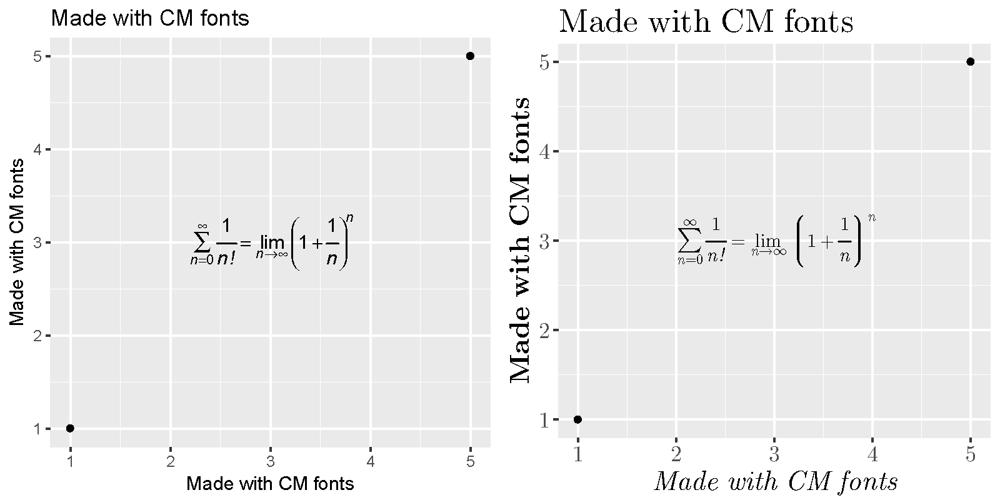

--- 
title: "A Minimal Book Example"
author: "黄湘云"
date: "`r Sys.Date()`"
site: bookdown::bookdown_site
geometry: margin=1.18in
documentclass: ctexbook
bibliography: [book.bib, packages.bib]
biblio-style: apalike
lof: yes
lot: yes
graphics: yes
tables: yes
link-citations: yes
colorlinks: yes
classoption: "hyperref, a4paper, UTF8, zihao = -4, linespread = 1.3"
description: "This is a minimal example of using the bookdown package to write a book. The output format for this example is bookdown::gitbook."
---


```{r setup, include=FALSE}
knitr::opts_chunk$set(
  comment = "#>",
  collapse = TRUE,
  echo = TRUE,
  # cache = TRUE,
  out.width = "70%",
  fig.align = 'center',
  fig.width = 6,
  fig.asp = 0.618,  # 1 / phi
  fig.show = "hold"
)
```

\mainmatter

# 前言 {#preface}

This is a _sample_ book written in **Markdown**. You can use anything that Pandoc's Markdown supports, e.g., a math equation $a^2 + b^2 = c^2$.

The **bookdown** package can be installed from CRAN or Github:

```{r eval=FALSE}
install.packages("bookdown")
# or the development version
# devtools::install_github("rstudio/bookdown")
```

Remember each Rmd file contains one and only one chapter, and a chapter is defined by the first-level heading `#`.

To compile this example to PDF, you need XeLaTeX. You are recommended to install TinyTeX (which includes XeLaTeX): <https://yihui.name/tinytex/>.

Pandoc\index{Pandoc} and Hugo\index{Hugo}


## 读图

导入 SVG 格式的图片, rsvg [@R-rsvg] 批量转化 svg 文件为 pdf 文件

```{r rsvg, eval = (!"webp" %in% .packages(TRUE))}
install.packages("webp","rsvg", dependencies = TRUE)
```

```r
library(rsvg)
tmp <- 'figure/Ink' # svgs 存放目录
input_paths <- paste0(tmp, '/', list.files(tmp) )
output_paths <- paste0('figure/pdf', '/', gsub('svg','pdf',list.files(tmp)) ) 

for( i in seq(length( list.files(tmp) )) ){
  rsvg_pdf(input_paths[i],file = output_paths[i])
}
```

magick 的简单使用

```{r, eval= (!"magick" %in% .packages(TRUE))}
install.packages("magick", dependencies = TRUE)
```

插入 Inkscape 图标，如图

```{r inkscape-logo, eval = knitr::is_latex_output(),fig.cap="Inkscape 图标"}
library(magick)
magick::image_read_svg(path = "figures/inkscape.svg")
```

`r if (knitr::is_html_output()) '
'
`

安装依赖库

```bash
sudo apt-get update && sudo apt-get install -y libgsl-dev libdieharder-dev
```

安装并加载 RDieHarder 包

```{r}
if (!"RDieHarder" %in% list.files(.libPaths())) install.packages("RDieHarder")
library(RDieHarder) # 加载
```

RDieHarder [@R-RDieHarder] 由 Dirk Eddelbuettel 开发，将 Robert G. Brown 的工作介绍给 R 用户

```{r}
if (!"purrr" %in% list.files(.libPaths())) install.packages("purrr")
library(purrr)
dieharderGenerators() %>% head
```

```{r}
dieharderTests() %>% head
```


```{r run-length-hist, fig.cap='游程直方图', fig.showtext=TRUE}
set.seed(2018) 
n <- 2^24
x <- runif(n,0,1)
delta <- 0.01
len <- diff(c(0,which(x < delta),n+1))-1
ylim <- seq( 0, 1800, by = 300)
xlim <- seq( 0, 100, by = 20)
p <- hist(len[len < 101], breaks = -1:100+0.5, plot = FALSE)
par(mar = c(2,2,.5,.5))
plot(p, xlab = '间距', ylab = '频数', axes = FALSE, 
     col = "lightblue", border = "white", main = "")	 
axis( 1, labels = xlim, at = xlim, las = 1) # x 轴
axis( 2, labels = ylim, at = ylim, las = 0) # y 轴
box(col="gray")
# 添加线性回归线
xx <- seq.int(from = 0, to = 100, by = 1)
xy <- p$counts
options(digits = 2)
fit <- lm(xy~xx)
abline(fit, col = 'red')
b = coef(fit)
# mtext(paste0( "Y = ", paste0(paste0(b[1], b[2]),"x") ), side = 3, cex = 2)
```


## 字体

字体设置包括自定义中文字体、英文字体和数学公式。

### showtext 

下载和安装 showtext 包[@Qiu2015]，下载并加载思源字体

```{r font-setup, eval= (!"showtext" %in% .packages(TRUE))}
install.packages("showtext",dependencies = TRUE)
library(showtext)
# Install Source Han Sans/Serif font (by default Simplified Chinese)
font_install(source_han_serif("CN")) # 思源宋体
font_install(source_han_sans("CN"))  # 思源黑体
```

showtext 包可以调用系统字体，图\@ref(fig:demo-ggplot2)使用5号思源宋体，英文和数字使用 serif 字体。详细的使用文档可以看 [showtext 的开发页面](https://github.com/yixuan/showtext)

```{r demo-ggplot2, fig.showtext = TRUE,fig.cap="showtext包处理图里的中文"}
library(ggplot2)
ggplot(iris, aes(Sepal.Length, Sepal.Width)) +
  geom_point(aes(colour = Species)) +
  scale_colour_brewer(palette = "Set1") +
  labs(
    title = "鸢尾花数据的散点图",
    x = "萼片长度", y = "萼片宽度", colour = "鸢尾花类别"
  ) +
  theme_minimal(base_size = 10.54, base_family = "source-han-serif-cn") +
  theme(
    legend.text = element_text(family = "serif", size = 10.54),
    axis.text = element_text(family = "serif", size = 10.54)
    )
```

用 ggplot2 画个简单地图，地图数据在 mapdata 包 [@R-mapdata]

```{r install-spatial, eval = (!"mapproj" %in% .packages(TRUE))}
install.packages(c("maps", "mapdata", "mapproj"), dependencies = TRUE)
```

如图 \@ref(fig:map-Fiji-earthquake) 所示

```{r map-Fiji-earthquake, fig.showtext=TRUE,fig.cap="斐济地震带"}
library(maps)
library(mapdata)
FijiMap <- map_data("worldHires", region = "Fiji")
ggplot(FijiMap, aes(x = long, y = lat)) +
  geom_map(map = FijiMap, aes(map_id = region), size = .2) +
  geom_point(data = quakes, aes(x = long, y = lat, colour = mag), pch = 16) +
  xlim(160, 195) +
  scale_colour_distiller(palette = "Spectral") +
  scale_y_continuous(breaks = (-18:18) * 5) +
  coord_map("ortho", orientation = c(-10, 180, 0)) +
  labs(colour = "震级", x = "经度", y = "纬度", title = "斐济地震带") +
  theme_minimal() +
  theme(
    title = element_text(family = "source-han-sans-cn"),
    axis.title = element_text(family = "source-han-serif-cn"),
    legend.title = element_text(family = "source-han-sans-cn"),
    legend.position = c(1, 0), legend.justification = c(1, 0)
  )
```

用 base plot 画地图，如图 \@ref(fig:maps-unemp-plot) 所示

```{r maps-unemp-plot, fig.cap="2009年美国各城镇失业率",fig.width=8,fig.height=6}
library(mapproj) 	
data(unemp)
data(county.fips)
colors <- c("#F1EEF6", "#D4B9DA", "#C994C7", "#DF65B0", "#DD1C77", "#980043")
unemp$colorBuckets <- as.numeric(cut(unemp$unemp, c(0, 2, 4, 6, 8, 10, 100)))
leg.txt <- c("<2%", "2-4%", "4-6%", "6-8%", "8-10%", ">10%")
cnty.fips <- county.fips$fips[match(map("county", plot=FALSE)$names,
                                    county.fips$polyname)]
colorsmatched <- unemp$colorBuckets[match(cnty.fips, unemp$fips)]
op <- par(mar=c(0,0,2,0))
# draw map
map("county", col = colors[colorsmatched], fill = TRUE, resolution = 0,
    lty = 0, projection = "polyconic")
map("state", col = "white", fill = FALSE, add = TRUE, lty = 1, lwd = 0.2,
    projection="polyconic")
title("unemployment by county, 2009")
legend("top", leg.txt, horiz = TRUE, fill = colors)
par(op)  
```

### xkcd

这篇文章主要使用 ggplot2 包[@Wickham2016]绘图，为了好玩我们还使用 xkcd 字体，先下载和加载 xkcd 包[@R-xkcd]，它提供一个 gg 风格的图层`theme_xkcd()`

```{r xkcd-setup, eval=(!"xkcd" %in% .packages(TRUE))}
install.packages("xkcd",dependencies = TRUE)
```

下载和注册 xkcd 字体

```{r download-xkcd, eval= (!'xkcd' %in% extrafont::fonts())}
download.file("http://simonsoftware.se/other/xkcd.ttf",
  dest = "xkcd.ttf", mode = "wb"
)
system("mkdir ~/.fonts")
system("cp xkcd.ttf ~/.fonts")
library(extrafont)
font_import(pattern = "[X/x]kcd", prompt = FALSE)
if (.Platform$OS.type != "unix") {
  ## Register fonts for Windows bitmap output
  loadfonts(device = "win")
} else {
  loadfonts() # 加载字体
}
fonts() # 查看可用的字体
```

图 `r ifelse(knitr::is_html_output(),'\\@ref(fig:xkcd-demo)','\\@ref(fig:xkcd-embed)') ` 是一个简单使用 xkcd 字体的例子

```{r xkcd-demo, fig.cap = "xkcd 风的图", eval = knitr::is_html_output()}
# pdf(file = 'figures/xkcd.pdf',width = 6,height = 4)
library(xkcd)
ggplot(aes(mpg, wt), data = mtcars) + geom_point() +
    theme_xkcd()
# dev.off()
# embed_fonts("figures/xkcd.pdf", outfile = "figures/xkcd_embed.pdf")
```

```{r xkcd-embed,fig.cap = "xkcd 风的图", eval= knitr::is_latex_output(), echo=FALSE}
knitr::include_graphics("figures/xkcd_embed.pdf")
```

### fontcm

安装 fontcm 包[@R-fontcm]处理数学公式，下载 fontcm 包^[<https://github.com/wch/fontcm>] 和相关字体

```{r download-fontcm, eval=(!"fontcm" %in% .packages(TRUE))}
library(extrafont)
install.packages("fontcm",dependencies = TRUE)
# 或 font_install('fontcm') 
loadfonts() # 加载字体
```

使用 fontcm 包，一个小 demo 如下

```{r fontcm-demo,fig.cap="默认风格与fontcm",dev='png'}
library(fontcm)
p <- qplot(c(1, 5), c(1, 5)) +
  xlab("Made with CM fonts") + ylab("Made with CM fonts") +
  ggtitle("Made with CM fonts")
# Equation
eq <- "italic(sum(frac(1, n*'!'), n==0, infinity) ==
       lim(bgroup('(', 1 + frac(1, n), ')')^n, n %->% infinity))"
# Without the new fonts
p1 <- p + annotate("text", x = 3, y = 3, parse = TRUE, label = eq) # fig 1
# With the new fonts
p2 <- p + annotate("text",
  x = 3, y = 3, parse = TRUE,
  family = "CM Roman", label = eq
) +
  theme(
    text = element_text(size = 16, family = "CM Roman"),
    axis.title.x = element_text(face = "italic"),
    axis.title.y = element_text(face = "bold")
  ) # fig 2
library(gridExtra)
grid.arrange(p1,p2, nrow = 1, ncol = 2)
```

保存成图片

```r
pdf(file = 'figures/ggplot_cm.pdf',width = 8,height = 4)
grid.arrange(p1,p2, nrow = 1, ncol = 2)
dev.off()
```

使用 ghostscript 嵌入数学字体，最终效果如图\@ref(fig:fontcm-ggplot)所示，

```{r embed,eval=FALSE}
# Embed the fonts
embed_fonts("figures/ggplot_cm.pdf", outfile = "figures/ggplot_cm_embed.pdf")
```
```{r fontcm-ggplot, echo=FALSE,fig.cap="fontcm 处理数学公式"}

```


## 软件信息

系统安装的 R 包有：

```{r}
.packages(TRUE)
```

R 软件运行环境：

```{r}
devtools::session_info()
```


```{r include=FALSE}
# automatically create a bib database for R packages
knitr::write_bib(c(
  .packages(), "bookdown", "knitr", "rmarkdown", "showtext", "rsvg",
  "mapdata", "ggplot2", "rstan", "xkcd", "fontcm","RDieHarder","magick"
), "packages.bib")
```
